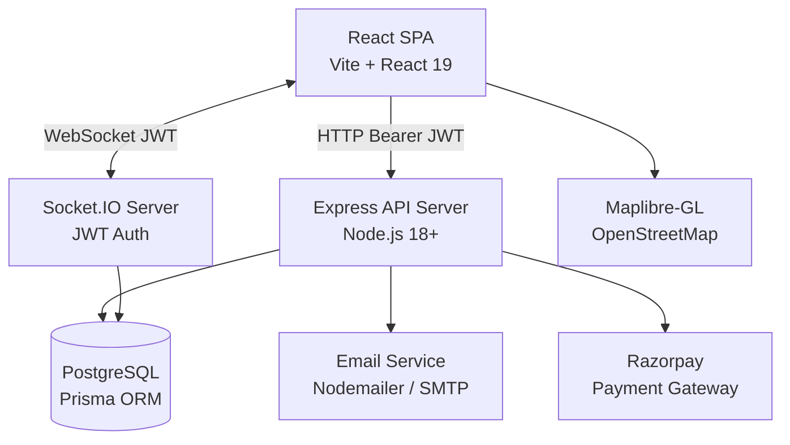
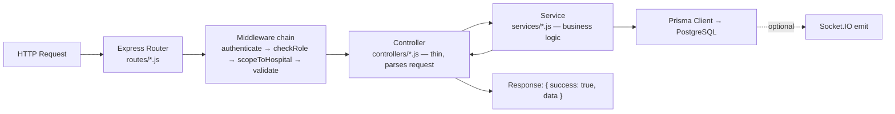
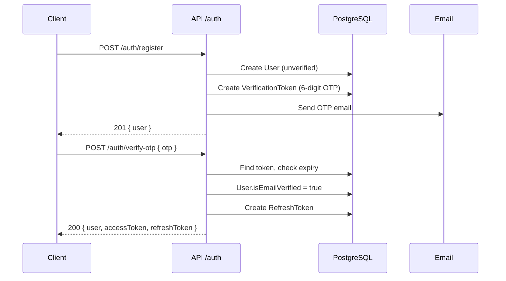
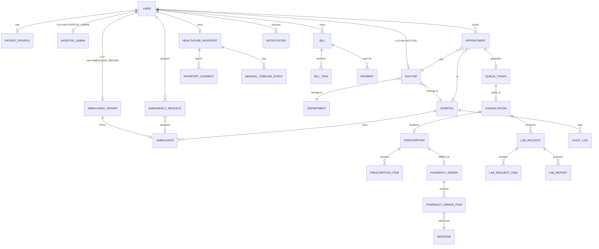
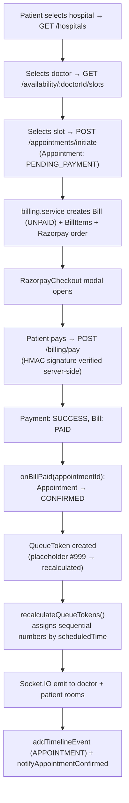
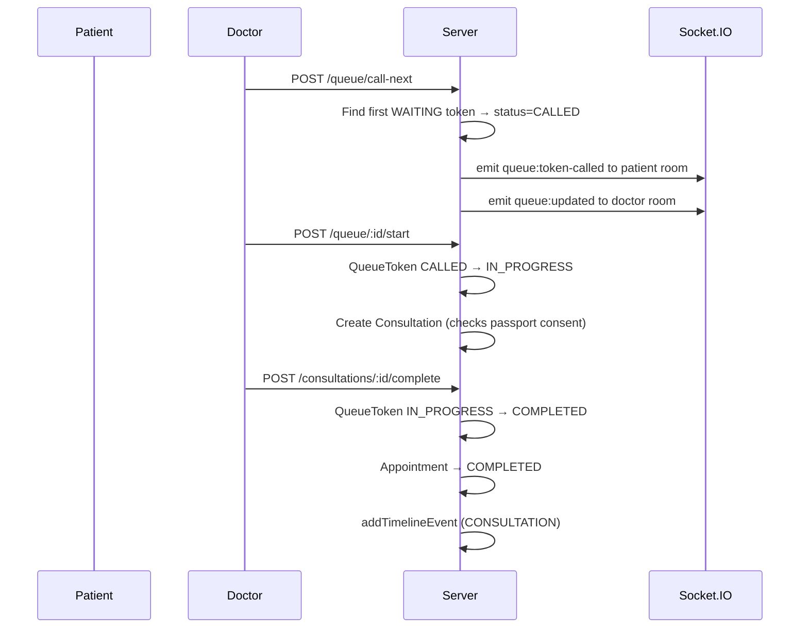
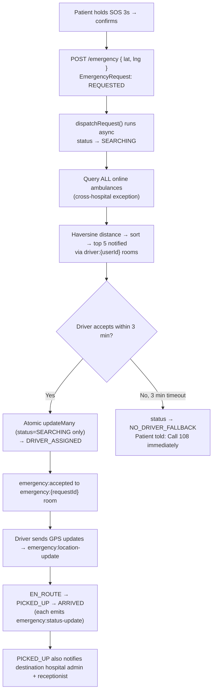

# Healthcare+

## 1. Project Overview

**Healthcare+** is a full-stack, multi-tenant hospital management and patient-facing
healthcare platform built on the PERN stack (PostgreSQL, Express, React, Node.js). It
connects patients, doctors, hospitals, pharmacies, labs, and ambulance drivers in a single
digital ecosystem.

### Problem Statement

- Hospitals, pharmacies, labs, and ambulances operate in isolation.
- Patients hold paper prescriptions that get lost or damaged.
- OPD waiting rooms are overcrowded with no visibility into queue status.
- In emergencies, there's no digital coordination between patients and ambulances.
- Medical history is siloed per hospital, breaking continuity of care.

### Solution

1. **Universal Healthcare Passport** — a patient-controlled digital health record accessible
   across all network hospitals.
2. **Real-time OPD Queue Tracking** — patients watch their token number live from their phone.
3. **Emergency SOS & Ambulance Dispatch** — one-tap request, nearest-driver algorithm, live
   GPS tracking on a map.
4. **End-to-End Clinical Workflow** — Booking → Payment → Queue → Consultation →
   Prescription → Pharmacy → Lab → Reports, all in one system.
5. **Unified Billing** — one bill consolidating appointments, pharmacy orders, and lab tests
   via Razorpay.

### Vision

To become the operating system for multi-specialty hospitals in India, giving every patient
— regardless of hospital — a seamless, connected, data-informed care journey.

### Long-Term Goals *(roadmap — not built)*

- AI-powered pre-visit symptom checker and triage (upgrade beyond current keyword matching)
- Telemedicine (encrypted in-app video consultations)
- Wearable integration (Apple Health / Google Fit → Passport)
- Insurance API integration for direct claim processing
- Integration with India's National Digital Health Mission (ABDM)

---

## 2. Current Implementation Status

**Phase 15 complete.** All 15 build phases are implemented and verified via static
verification and a passing production build. The project has undergone a 24-item repair plan
(**R1–R24**, documented in `docs/FINAL-REPORT.md`) to eliminate simulated business logic and
replace it with real backend/database/WebSocket flows.

> ⚠️ Runtime E2E has **not** been performed against a live multi-tenant database — all
> authorization fixes (R1–R24) were verified by code-read only. See [Section 17](#17-known-issues-gaps--technical-risks).

---

## 3. Target Users & Roles

| Role | Description |
|---|---|
| `PATIENT` | Books appointments, tracks queue, views Healthcare Passport, requests SOS |
| `DOCTOR` | Manages daily queue, conducts consultations, writes prescriptions & lab requests |
| `HOSPITAL_ADMIN` | Manages hospital departments, doctors, staff, queue oversight, analytics |
| `RECEPTIONIST` | Views appointments, manages check-ins, updates queue |
| `PHARMACIST` | Processes pharmacy orders, updates stock |
| `LAB_STAFF` | Processes lab requests, uploads reports |
| `AMBULANCE_DRIVER` | Goes online, accepts/rejects dispatches, updates GPS location |
| `SUPER_ADMIN` | Manages all hospitals, users, global analytics |

---

## 4. Feature Inventory

### ✅ Implemented

- Patient registration + email OTP verification
- Google OAuth sign-in (patient self-registration only)
- Staff invitation system (email-based invite with default password)
- JWT auth with silent refresh (15-min access token, 30-day refresh token)
- Hospital & department management
- Doctor availability & slot generation (with lunch-break restrictions)
- Appointment booking with Razorpay payment
- OPD queue with WebSocket real-time updates
- Healthcare Passport (allergies, conditions, medications, consent management)
- Medical timeline (chronological history of all clinical events)
- Doctor consultation screen (symptoms, diagnosis, treatment plan, autosave)
- Digital prescriptions & pharmacy orders
- Lab requests & lab report upload (PDF)
- Unified billing (Appointment / Pharmacy / Lab → single Bill → Razorpay → `onBillPaid`)
- Emergency SOS with geo-dispatch, live GPS tracking, ambulance dashboard
- In-app + Socket.IO notifications (with selective email for 4 key event types)
- Hospital analytics (appointments, revenue, queue load, emergency stats)
- Audit log for admin actions
- "Lite" walk-in appointments (fractional queue tokens, e.g. `10.5`)
- AI symptom triage (**keyword-based** specialty routing — not ML)
- Admin queue override (force-skip with audit log)

### 🔜 Planned / Not Built

- Cloudinary integration for lab report PDFs (currently local disk storage)
- Redis adapter for Socket.IO (multi-instance scaling)
- Redis caching for slot availability / hospital listings
- Route-level code splitting (React.lazy + Suspense)
- Telemedicine (WebRTC video consultations)
- Real LLM-based AI triage (replacing keyword matching)
- Web Push notifications (for when Socket.IO isn't connected)
- ABDM (National Digital Health Mission) integration
- Swagger/OpenAPI spec, CI pipeline, E2E test suite execution

---

## 5. System Architecture



**Core rule:** PostgreSQL is the source of truth. Prisma handles database access. Express
handles business logic and REST APIs. React handles the UI. Socket.IO handles genuinely
real-time features (queue, emergency tracking). No Redis or microservices in the current
build — deliberately kept simple.

### Backend Request Flow (Layered)



### Frontend Architecture

- **Entry point:** `main.jsx` → `App.jsx` → wraps `<GoogleOAuthProvider>`, `<BrowserRouter>`,
  renders `<AppRouter>`
- **Routing:** React Router v7, role-based protection via `ProtectedRoute` (Outlet pattern)
- **State:** Zustand with persistence —
  - `authStore`: user object + JWT access token (persisted in `localStorage` under
    `healthcare-plus-auth`)
  - `notificationStore`: in-memory notification list, unread count, optimistic reads
- **HTTP layer:** Single Axios instance (`services/api.js`). Applies Bearer token on every
  request. On 401 → silent refresh flow with concurrent-request queuing. Auto-unwraps
  `{ success, data }` envelope.
- **WebSocket layer:** Singleton Socket.IO client (`services/socket.js`). JWT in handshake
  auth. Reconnection with automatic room-rejoin via a `joinIntents` map.

### Real-Time Architecture

Server is authoritative: client calls a REST endpoint → server writes to DB → server emits a
Socket.IO event to a room → all room subscribers receive the live update.

| Room | Purpose |
|---|---|
| `user:{userId}` | Personal notifications for all roles |
| `patient:{patientId}` | Legacy queue updates for patients |
| `doctor:{doctorId}:{date}` | Doctor's daily queue room |
| `hospital:{hospitalId}:queue` | Hospital-wide admin queue monitor |
| `emergency:{requestId}` | Patient + admin emergency tracking |
| `driver:{userId}` | Driver incoming request notifications |

### Application Boot Sequence

1. `server.js` imports `app.js` (Express configured)
2. `config/env.js` validates required env vars — fails hard if missing
3. HTTP server created with `http.createServer(app)`
4. `initializeSocket(server)` — Socket.IO attaches, JWT middleware registered
5. `setDispatchIo(io)` — injects Socket.IO into `emergencyDispatch.service`
6. `server.listen(PORT)` — starts accepting connections
7. `SIGTERM` handler registered for graceful shutdown

---

## 6. Tech Stack

### Frontend

| Technology | Version | Role |
|---|---|---|
| React | 19.2.8 | UI framework |
| Vite | 8.2.0 | Build tool + dev server |
| React Router DOM | 7.18.2 | Client-side routing |
| Tailwind CSS | 4.3.3 | Utility-first CSS |
| Zustand | 5.0.14 | Global state management |
| Axios | 1.19.0 | HTTP client |
| Socket.IO Client | 4.8.3 | Real-time WebSocket client |
| @react-oauth/google | 0.13.5 | Google OAuth button |
| Maplibre-GL | 6.2.0 | Interactive maps (ambulance tracking) |
| Lucide React | 1.30.0 | Icon library |

### Backend

| Technology | Version | Role |
|---|---|---|
| Node.js | ≥18.0.0 | JavaScript runtime |
| Express | 4.21.1 | Web framework |
| Socket.IO | 4.8.1 | Real-time WebSocket server |
| Prisma | 5.22.0 | ORM + migration tool |
| PostgreSQL | v14+ | Relational database |
| bcryptjs | 3.0.3 | Password hashing |
| jsonwebtoken | 9.0.3 | JWT sign/verify |
| google-auth-library | 11.0.0 | Google OAuth token verification |
| nodemailer | 9.0.5 | Email delivery (SMTP) |
| zod | 4.4.3 | Schema validation |
| express-rate-limit | 8.6.2 | IP-based rate limiting |
| helmet | 8.0.0 | Security HTTP headers |
| multer | 2.2.0 | Multipart file upload (lab reports) |
| cors | 2.8.5 | CORS middleware |
| morgan | 1.10.0 | HTTP request logger |
| uuid | 14.0.1 | UUID generation |

### External Services

| Service | Usage | Status |
|---|---|---|
| Razorpay | Payment gateway (appointments, pharmacy, lab) | Implemented |
| Maplibre-GL / OpenStreetMap | Ambulance live tracking map | Implemented |
| Nodemailer (SMTP / Gmail / Resend) | Email OTPs, invites, notifications | Implemented (requires SMTP config) |
| Cloudinary | Image/document storage | **Planned** — lab reports currently on local disk |

### Dev Tools

| Tool | Version | Role |
|---|---|---|
| nodemon | 3.1.7 | Auto-restart backend in dev |
| Jest | 30.4.2 | Backend unit testing |
| Supertest | 7.2.2 | HTTP assertion testing |
| Playwright | 1.62.1 | Frontend E2E testing (config exists, no test files yet) |
| oxlint | 1.75.0 | Fast frontend linter |

---

## 7. Folder Structure

```
healthcare-plus/
├── backend/                        # Node.js Express REST API + Socket.IO
│   ├── prisma/
│   │   ├── schema.prisma           # Single source of truth for all DB models (1049 lines)
│   │   ├── seed.js                 # DB seeder (hospitals, departments, doctors)
│   │   └── migrations/
│   ├── scripts/seedDemoData.js     # Extended demo seeder (npm run seed:demo)
│   ├── uploads/                    # Local static file storage for lab report PDFs
│   └── src/
│       ├── server.js               # HTTP server entry, Socket.IO init, graceful shutdown
│       ├── app.js                  # Express app: middleware stack, route mounting
│       ├── config/                 # env.js (fail-fast validation), cors.js
│       ├── routes/                 # 33 route files — one per business module
│       ├── controllers/            # 26 controllers — thin request/response handlers
│       ├── services/                # 33 services — CORE BUSINESS LOGIC
│       ├── middleware/             # 8 files: authenticate, checkRole, scopeToHospital,
│       │                           #   validate, rateLimiter, errorHandler, notFound, requestLogger
│       ├── sockets/                # Socket.IO init + emergency room handlers
│       ├── templates/emails/       # verifyEmail.html, resetPassword.html
│       ├── utils/                  # ApiError, asyncHandler, jwt, hash, geo, tokenGenerator
│       └── __tests__/              # 11 Jest test files
│
├── frontend/                       # React 19 + Vite 8 SPA
│   └── src/
│       ├── router/AppRouter.jsx    # Full role-based route tree (158 lines)
│       ├── layouts/PublicLayout.jsx
│       ├── pages/
│       │   ├── public/             # Landing, Login, Register, VerifyEmail, ForgotPassword,
│       │   │                       #   ResetPassword, AcceptInvite
│       │   ├── patient/            # Dashboard, HospitalWorkspace, DoctorBooking,
│       │   │                       #   AppointmentConfirmation, LiveQueue, Passport,
│       │   │                       #   MedicalTimeline, EmergencyTracking
│       │   ├── doctor/             # Dashboard, Queue, ConsultationScreen, PatientProfileView
│       │   ├── admin/              # Dashboard (Overview/Doctors/Staff/Queue/Analytics/Billing)
│       │   ├── lab/                # Dashboard
│       │   ├── pharmacy/           # Dashboard
│       │   ├── driver/             # Dashboard
│       │   └── superadmin/         # Dashboard
│       ├── components/             # admin/, auth/, booking/, common/, consultation/,
│       │                           #   emergency/, layout/, notifications/, passport/, queue/
│       ├── hooks/                  # useAuth, useDebounce, useDoctorQueue, useGeolocation,
│       │                           #   useNotifications
│       ├── services/                # 24 Axios service files — one per backend module
│       ├── store/                  # authStore.js, notificationStore.js (Zustand)
│       └── utils/                  # constants.js, distance.js, roleRedirect.js
│
└── docs/                           # Architecture and audit documentation
    ├── API-INTEGRATION-AUDIT.md
    ├── AUTH-AUTHORIZATION-AUDIT.md
    ├── CODEBASE-UNDERSTANDING.md
    ├── COMPLETE-WORKFLOW-AUDIT.md
    ├── FINAL-REPORT.md             # 24-item repair report (R1–R24) — key read
    ├── GOOGLE-MAPS-INTEGRATION-PLAN.md
    ├── MANUAL-E2E-TEST-PLAN.md
    ├── MASTER-REPAIR-PLAN.md
    ├── REALTIME-AUDIT.md
    └── ROUTE-AUDIT.md
```

---

## 8. Authentication & Authorization

### Registration (Patient)

1. `POST /auth/register { email, password, fullName }`
2. Validates email format + password strength (Zod), normalizes email
3. Checks for existing account → `409 Conflict`
4. Hashes password with bcryptjs; creates `User` (`role=PATIENT`, `isEmailVerified=false`)
5. Generates 6-digit OTP, sends via Nodemailer
6. Returns user object — no token until email is verified

### Email Verification (OTP)

`POST /auth/verify-otp` finds the token, checks expiry + email match, marks the user
verified, deletes the (single-use) token, then issues an access + refresh token pair
(auto-login).

### Login

`POST /auth/login` guards against `INVITED`/`DEACTIVATED` status and against GOOGLE-only
accounts attempting password login, compares bcrypt hash, updates `lastLoginAt`, then issues:

- **Access token:** `{ sub: userId, role }` signed with `JWT_SECRET`, 15-minute default expiry
- **Refresh token:** `{ sub: userId }` signed with `JWT_REFRESH_SECRET`, stored as a SHA-256
  hash in `refresh_tokens`, 30-day default expiry

### Silent Token Refresh

Client's Axios interceptor detects a 401 on a non-auth endpoint, calls
`POST /auth/refresh-token` via a bare client (no interceptors), verifies the stored hash,
issues a new access token, updates local state, and retries the original request. Concurrent
401s are queued and resolved by a single shared refresh.

### Google OAuth

`POST /auth/google { idToken }` verifies with `google-auth-library`, upserts by `googleId`
then by email, sets `authProvider = GOOGLE` or `BOTH`, issues a token pair.

### RBAC Middleware Chain

```
authenticate → checkRole(...) → scopeToHospital
```



### Password Reset

`forgot-password` (60s cooldown OTP) → `verify-reset-otp` → `reset-password`, which updates
the hash, marks the token used, and **revokes all refresh tokens** for that user.

---

## 9. Database Architecture

**PostgreSQL via Prisma ORM.** Full schema is 1,049 lines, 30+ models, 15+ enums.

### ER Diagram (Core Relationships)



### Key Enums

```
Role:               PATIENT | DOCTOR | HOSPITAL_ADMIN | RECEPTIONIST | PHARMACIST |
                     LAB_STAFF | AMBULANCE_DRIVER | SUPER_ADMIN
AuthProvider:        LOCAL | GOOGLE | BOTH
UserStatus:          INVITED | ACTIVE | DEACTIVATED
AppointmentStatus:   PENDING_PAYMENT | CONFIRMED | CANCELLED | COMPLETED | NO_SHOW
AppointmentType:     REGULAR | LITE
QueueStatus:         WAITING | CALLED | IN_PROGRESS | COMPLETED | SKIPPED | CANCELLED
ConsultationStatus:  IN_PROGRESS | COMPLETED
LabRequestStatus:    PENDING | CONFIRMED | SAMPLE_COLLECTED | PROCESSING | COMPLETED | CANCELLED
PharmacyOrderStatus: PENDING | CONFIRMED | PREPARING | PACKED | READY | COMPLETED | CANCELLED
BillStatus:          UNPAID | PAID | CANCELLED
PaymentStatus:       CREATED | SUCCESS | FAILED
EmergencyStatus:     REQUESTED | SEARCHING | DRIVER_ASSIGNED | EN_ROUTE | PICKED_UP |
                     ARRIVED | CANCELLED | NO_DRIVER_FALLBACK
TimelineEventType:   APPOINTMENT | CONSULTATION | PRESCRIPTION | LAB_REQUEST |
                     LAB_REPORT | MEDICATION
```

### Table Reference

**Core Identity**
| Table | Key Fields | Notes |
|---|---|---|
| `users` | id, email, passwordHash, fullName, role, isEmailVerified, googleId, authProvider, status, lastLoginAt | One-to-one with role profiles |
| `patient_profiles` | userId, phone, dateOfBirth, gender, address, bloodGroup, emergencyContactName | Optional extended patient info |

**Auth Tokens**
| Table | Key Fields | Notes |
|---|---|---|
| `verification_tokens` | userId, token, expiresAt | 6-digit OTP for email verify |
| `password_reset_tokens` | userId, token, expiresAt, usedAt | 6-digit OTP, single-use |
| `refresh_tokens` | userId, tokenHash, expiresAt, revokedAt | Database-backed refresh token |
| `invite_tokens` | userId, token, invitedBy, expiresAt | Staff invitation |

**Hospital Infrastructure**
| Table | Key Fields | Notes |
|---|---|---|
| `hospitals` | id, name, address, city, latitude, longitude, contactPhone, specialities[], averageRating | Multi-tenant isolation root |
| `departments` | id, name, hospitalId | Linked to hospitals |
| `doctors` | id, userId, hospitalId, departmentId, specialization, consultationFee, acceptsLiteAppointments | Staff profile |
| `hospital_admins` / `receptionists` / `pharmacists` / `lab_staff` / `ambulance_drivers` | id, userId, hospitalId | Staff profiles |
| `ambulances` | id, hospitalId, driverId (unique), vehicleNumber, isOnline, currentLatitude, currentLongitude | GPS-tracked vehicle |

**Clinical Workflow (the core)**
| Table | Key Fields | Notes |
|---|---|---|
| `doctor_availability` | doctorId, dayOfWeek, startTime, endTime, slotMinutes | Repeating weekly schedule |
| `appointments` | patientId, doctorId, hospitalId, departmentId, scheduledDate, scheduledTime, fee, status, appointmentType | Unique per doctor+date+time |
| `queue_tokens` | appointmentId (unique), doctorId, hospitalId, queueDate, tokenNumber (**Float**), status | Float type enables Lite fractional tokens |
| `consultations` | appointmentId (unique), queueTokenId (unique), doctorId, patientId, symptoms, diagnosis, treatmentPlan, status | Core clinical note |
| `prescriptions` | consultationId (unique), doctorId, patientId, generalInstructions | |
| `prescription_items` | prescriptionId, medicineName, dosage, frequency, durationDays | |
| `lab_requests` | consultationId, doctorId, patientId, priority, status | |
| `lab_request_items` | labRequestId, testName, estimatedPrice | |
| `lab_reports` | labRequestId, reportFileUrl, resultSummary, uploadedByUserId | Local file path to PDF |
| `follow_up_recommendations` | consultationId, patientId, doctorId, recommendedDate, reason, status | |

**Healthcare Passport**
| Table | Key Fields | Notes |
|---|---|---|
| `healthcare_passports` | patientId (unique), allergies[], medicalConditions[], currentMedications[], notes | Created lazily on first access |
| `passport_consents` | passportId, hospitalId?, doctorId?, grantedAt, revokedAt | Granular, revocable consent |
| `medical_timeline_events` | passportId, eventType, sourceId, title, eventDate | Polymorphic timeline |

**Billing**
| Table | Key Fields | Notes |
|---|---|---|
| `bills` | patientId, hospitalId, sourceType, sourceId, subtotal, discount, tax, total, status | Unified bill for all payables |
| `bill_items` | billId, description, quantity, unitPrice, subtotal | Line items |
| `payments` | billId, amount, currency, razorpayOrderId (unique), razorpayPaymentId, status | Razorpay payment record |

**Pharmacy**
| Table | Key Fields | Notes |
|---|---|---|
| `medicines` | hospitalId, name, genericName, unit, price, stockQuantity | Per-hospital pharmacy stock |
| `pharmacy_orders` | prescriptionId (unique), patientId, hospitalId, status, totalAmount | Linked to prescription |
| `pharmacy_order_items` | pharmacyOrderId, prescriptionItemId (unique), medicineId, quantity, unitPrice | |

**Medicine Reminders**
| Table | Key Fields | Notes |
|---|---|---|
| `medicine_reminders` | patientId, medicineName, dosage, frequency, startDate, endDate, reminderTimes[] | |
| `medicine_reminder_logs` | reminderId, scheduledFor, status | Unique per reminder + scheduledFor |

**Lab Catalog**
| Table | Key Fields | Notes |
|---|---|---|
| `master_lab_categories` | id, name (unique) | Shared across hospitals |
| `master_lab_tests` | code (unique), categoryId, name, basePrice, sampleType | |
| `lab_test_catalog` | hospitalId, masterTestId, name, price, sampleType | Per-hospital pricing |

**Emergency**
| Table | Key Fields | Notes |
|---|---|---|
| `emergency_requests` | patientId, hospitalId, latitude, longitude, status, ambulanceId, destinationHospitalId, acceptedAt, pickedUpAt, arrivedAt | Full dispatch lifecycle |

**System**
| Table | Key Fields | Notes |
|---|---|---|
| `notifications` | userId, type, title, message, relatedId, isRead | All user notifications |
| `audit_logs` | hospitalId, actorUserId, action, targetType, targetId, metadata (JSON) | Immutable audit trail |

### Key Design Decisions

- `tokenNumber` is `Float` (not `Int`) so Lite walk-in appointments can insert fractional
  tokens (e.g. `10.5`) without a schema change.
- `MedicalTimelineEvent` uses a polymorphic `sourceId + eventType` pair instead of per-type
  foreign keys, allowing retroactive addition of new event types.
- `Bill.sourceId` is a plain string polymorphic FK (not a Prisma relation) to avoid circular
  schema dependencies.
- `RefreshToken.tokenHash` stores a hash, never the raw token.

---

## 10. API Architecture

**Base URL:** `http://localhost:5000/api` (dev)

The backend has **33 route files → 26 controllers → 33 services**, roughly one of each per
business module, following a strict pattern: routes mount middleware and controllers;
controllers validate input and call a service; services own all business logic and DB access.

### Auth (`/auth`)
| Method | Endpoint | Auth | Description |
|---|---|---|---|
| POST | `/auth/register` | None | Patient registration (OTP sent) |
| POST | `/auth/login` | None | Email+password login |
| POST | `/auth/google` | None | Google OAuth login |
| POST | `/auth/accept-invite` | None | Staff sets password from invite link |
| POST | `/auth/verify-otp` | None | Verify 6-digit email OTP |
| POST | `/auth/resend-verification` | None | Resend OTP (60s cooldown) |
| POST | `/auth/forgot-password` | None | Send password reset OTP |
| POST | `/auth/verify-reset-otp` | None | Verify reset OTP |
| POST | `/auth/reset-password` | None | Set new password |
| POST | `/auth/change-password` | JWT | Change password |
| POST | `/auth/logout` | None | Revoke refresh token (cookie) |
| GET | `/auth/me` | JWT | Get current user profile |
| POST | `/auth/refresh-token` | Cookie | Silently renew access token |

### Hospitals, Departments, Doctors, Staff
| Method | Endpoint | Auth | Description |
|---|---|---|---|
| GET | `/hospitals` | JWT | List hospitals (geo-sorted) |
| GET | `/hospitals/nearby` | JWT | Find hospitals near lat/lng |
| POST / PUT | `/hospitals[/:id]` | JWT, SUPER_ADMIN | Create / update hospital |
| GET / POST | `/departments` | JWT [, HOSPITAL_ADMIN] | List / create departments |
| GET | `/doctors`, `/doctors/me`, `/doctors/:id` | JWT [, DOCTOR] | List, own profile, doctor + availability |
| POST / GET | `/staff/invite`, `/staff` | JWT, HOSPITAL_ADMIN | Invite staff / list staff |

### Availability & Appointments
| Method | Endpoint | Auth | Description |
|---|---|---|---|
| GET | `/availability/:doctorId/slots?date=` | JWT | Available time slots |
| POST | `/appointments/initiate` | JWT, PATIENT | Begin booking (creates Bill + Razorpay order) |
| GET | `/appointments[/:id]` | JWT | List / get appointment (role-gated) |
| POST | `/appointments/:id/cancel` | JWT, PATIENT | Cancel appointment |
| POST | `/appointments/:id/admin-cancel` | JWT, HOSPITAL_ADMIN | Admin cancel (audit logged) |

### Queue Management
| Method | Endpoint | Auth | Description |
|---|---|---|---|
| GET | `/queue/doctor/:doctorId` | JWT, DOCTOR | Doctor's daily queue |
| GET | `/queue/patient/:appointmentId` | JWT, PATIENT | Queue position + ETA |
| POST | `/queue/call-next` | JWT, DOCTOR | Call next WAITING patient |
| POST | `/queue/:id/start` \| `/complete` \| `/skip` \| `/requeue` | JWT, DOCTOR | State transitions |
| POST | `/admin/queue/:id/force-skip` | JWT, HOSPITAL_ADMIN | Admin force-skip (audit logged) |
| GET | `/admin/queue` | JWT, HOSPITAL_ADMIN | Hospital-wide queue overview |

### Billing & Payments
| Method | Endpoint | Auth | Description |
|---|---|---|---|
| POST | `/billing/initiate` | JWT | Create Bill + Razorpay order |
| POST | `/billing/pay` | JWT | Verify payment signature → `onBillPaid` |
| GET | `/bills[/:id]` | JWT | Bill history / single bill |

### Healthcare Passport
| Method | Endpoint | Auth | Description |
|---|---|---|---|
| GET / PUT | `/passport` | JWT, PATIENT | Get / update own passport |
| POST / DELETE | `/passport/consent[/:id]` | JWT, PATIENT | Grant / revoke consent |
| GET | `/passport/:patientId` | JWT, DOCTOR | Get patient passport (consent-gated) |

### Consultations, Prescriptions, Pharmacy
| Method | Endpoint | Auth | Description |
|---|---|---|---|
| POST | `/consultations/start` | JWT, DOCTOR | Start consultation |
| PATCH | `/consultations/:id` | JWT, DOCTOR | Autosave update |
| POST | `/consultations/:id/complete` | JWT, DOCTOR | Complete consultation |
| GET | `/consultations/recent`, `/history/:patientId` | JWT, DOCTOR | Recent / patient history (consent-gated) |
| POST | `/prescriptions` | JWT, DOCTOR | Create prescription |
| GET | `/pharmacy-orders` | JWT | List (role-scoped) |
| POST / PUT | `/pharmacy-orders/:id/confirm`, `/status` | JWT, PHARMACIST | Confirm order / update status |

### Lab Requests & Reports
| Method | Endpoint | Auth | Description |
|---|---|---|---|
| POST / GET | `/lab-requests` | JWT, DOCTOR / JWT | Create / list lab requests |
| POST | `/lab-fulfillment/:id/collect` \| `/process` \| `/upload-report` | JWT, LAB_STAFF | Lifecycle transitions |

### Emergency SOS & Driver
| Method | Endpoint | Auth | Description |
|---|---|---|---|
| POST | `/emergency` | JWT, PATIENT | Create SOS + geo-dispatch |
| GET | `/emergency/active`, `/history`, `/:id/status` | JWT, PATIENT | Active / history / poll status |
| GET / PUT | `/emergency`, `/:id/status` | JWT, HOSPITAL_ADMIN | View / update hospital emergencies |
| GET | `/driver/me` | JWT, AMBULANCE_DRIVER | Rehydrate state after reload |
| POST | `/driver/toggle-online`, `/location`, `/accept/:id`, `/reject/:id`, `/en-route/:id`, `/picked-up/:id`, `/arrived/:id` | JWT, AMBULANCE_DRIVER | Driver actions |

### Notifications & Analytics
| Method | Endpoint | Auth | Description |
|---|---|---|---|
| GET | `/notifications` | JWT | Paginated notifications + unread count |
| POST | `/notifications/:id/read`, `/read-all` | JWT | Mark read |
| GET | `/analytics/summary`, `/appointments`, `/departments`, `/doctors`, `/queue`, `/emergency` | JWT, HOSPITAL_ADMIN | Dashboard KPIs & trends |

### AI Triage
| Method | Endpoint | Auth | Description |
|---|---|---|---|
| POST | `/ai/triage` | JWT | Symptom → specialty + urgency mapping |

---

## 11. Core Workflows

### 11.1 Appointment Booking → Payment → Queue Token



Slot generation reads `DoctorAvailability`, excludes lunch-break slots (12:00–13:29), expires
stale `PENDING_PAYMENT` holds older than 10 minutes, and filters out already-booked slots.

### 11.2 Queue / Token Logic

- On confirmation, a `QueueToken` is created with a placeholder `tokenNumber=999`, then
  `recalculateQueueTokens()` immediately assigns sequential integers ordered by
  `scheduledTime`.
- Fractional tokens (e.g. `10.5`) from Lite walk-in appointments are preserved, not
  reassigned.
- Recalculation runs on: new appointment confirmed, appointment cancelled, appointment
  rescheduled.



### 11.3 Consultation → Prescription → Pharmacy

```
Doctor Prescribes → Patient Views Prescription → Patient Confirms Purchase →
Pharmacy Receives Order → Pharmacy Prepares → Packed → Patient Notified →
Payment if Pending → Patient Collects → Completed → Medicine Reminders Activated
```

Order status machine: `PENDING → CONFIRMED → PREPARING → PACKED → READY → COMPLETED`

### 11.4 Consultation → Lab Request → Report → Passport

```
Doctor Creates Lab Request → Patient Views Tests → Patient Confirms → Payment →
Laboratory Receives Request → Sample Collected → Testing → Report Uploaded →
Doctor + Patient Notified → Report Stored in Passport (Medical Timeline)
```

### 11.5 Unified Billing

Three payable sources — `APPOINTMENT`, `PHARMACY_ORDER`, `LAB_REQUEST` — all route through
`billing.service.js`:

1. `createBillAndInitiatePayment` → creates Bill + BillItems + `Payment(CREATED)` + Razorpay
   order
2. On payment success → `verifyAndCompletePayment` → marks PAID → calls the source-specific
   `onBillPaid()` callback via lazy import (avoids circular dependencies)
3. Callbacks: `APPOINTMENT` → confirms appointment + creates QueueToken; `PHARMACY_ORDER` /
   `LAB_REQUEST` → advance to `CONFIRMED`

### 11.6 Emergency SOS → Dispatch → Live Tracking



The cross-hospital ambulance search is a **deliberate, documented exception** to the
hospital-isolation rule — the nearest ambulance from *any* hospital is dispatched, not just
the patient's current hospital.

---

## 12. Real-Time Functionality

Socket.IO carries every feature that must feel instantaneous — everything else stays on
REST. In practice that's:

- OPD queue updates (`queue:updated`, `queue:token-called`)
- Emergency dispatch and tracking (5 event types: new-request, accepted, location-update,
  status-update, fallback)
- In-app notifications (`notification:new`)

**Socket rooms** are listed in [Section 5](#5-system-architecture). The client tracks every
room it has joined in a `joinIntents` map and automatically rejoins all of them on
reconnect — without this, listeners would silently stop working after a network drop.

---

## 13. Notifications

Two-layer delivery for every event:

1. **DB-persisted** — `Notification` record created for history
2. **Socket.IO pushed** — emitted to `user:{userId}` room as `notification:new`
3. **Email (selective)** — only for 4 high-value types: `APPOINTMENT_CONFIRMED`,
   `PAYMENT_RESULT`, `LAB_REPORT_READY`, `PASSPORT_ACCESS_CHANGED`

13 typed helper functions exist for consistency (`notifyAppointmentConfirmed`,
`notifyQueueYourTurn`, `notifyQueueYourTurnApproaching`, etc.), covering appointment, queue,
pharmacy, laboratory, billing, emergency, and passport events.

---

## 14. Security Architecture

### Implemented

| Area | Implementation |
|---|---|
| Authentication | JWT (15-min access + 30-day refresh) |
| Password Storage | bcryptjs hashing |
| SQL Injection | Prisma ORM parameterized queries |
| CORS | Origin allowlist (`CLIENT_URL` + dev-only localhost) |
| Security Headers | `helmet` middleware |
| Rate Limiting | `express-rate-limit`: 15 req/15min (auth), 5 req/15min (OTP) |
| Input Validation | Zod schemas on all auth endpoints |
| OTP Security | Email binding + expiry + single-use delete |
| Token Security | Refresh tokens stored as SHA-256 hash in DB |
| Hospital Isolation | `scopeToHospital` middleware + service-level scope checks |
| IDOR Prevention | Appointment/prescription/queue reads: default-deny + role-based ownership check |
| Error Info Leak | Stack traces + Prisma internals suppressed in production |
| No Secrets in Code | All secrets in `.env` (gitignored) |

### Passport Consent Enforcement

`checkDoctorConsent(patientId, doctorId)` checks for active, non-revoked consent for that
specific doctor OR for that doctor's hospital. Without consent, a consultation can still
proceed but `passportSummary` is `null` and `passportAccessDenied: true` is returned;
consultation history is scoped to same-hospital records only.

### Pre-Production Action Items (from the audit)

1. No production deployment yet — `NODE_ENV=production` must be set to activate all guards
2. JWT secrets in local `.env` use dev-grade placeholders — must rotate before prod
3. SMTP not configured by default — emails silently fail if not set up
4. Runtime E2E testing not performed — authorization fixes verified by **code-read only**
5. Main JS chunk > 500KB uncompressed — route-level code splitting recommended
6. 71 oxlint warnings (harmless, unused imports)

---

## 15. Audit Logging

`audit_logs` is an append-only trail keyed by `hospitalId`, `actorUserId`, `action`,
`targetType`, `targetId`, and a JSON `metadata` field. Written via `auditLog.service.js`
(`recordAction()`), fired for actions such as doctor added/removed, fee changes, queue
overrides, staff changes, and hospital settings changes. Logging is fire-and-forget/async
with caught errors so it never blocks the request cycle.

---

## 16. Error Handling

### Backend

```
Error
└── ApiError (statusCode, message, details)
    ├── ApiError.badRequest(msg, details)    → 400
    ├── ApiError.unauthorized(msg)           → 401
    ├── ApiError.forbidden(msg)              → 403
    ├── ApiError.notFound(msg)               → 404
    ├── ApiError.conflict(msg, details)      → 409
    ├── ApiError.unprocessable(msg, details) → 422
    └── ApiError.internal(msg)               → 500
```

The global `errorHandler.js` maps Prisma error codes (`P2002` → 409 unique violation,
`P2025` → 404 not found, `P2003` → 400 FK failed) and bad JSON bodies (`SyntaxError` → 400).
Generic errors return 500 with the message suppressed in production. Prisma's
`err.meta.target` (raw DB column names) is never sent to the client.

### Frontend

Axios response interceptor normalizes errors to `{ status, message, errors }`; 401 triggers
silent refresh or redirect to login if refresh fails; a React `ErrorBoundary` wraps critical
UI trees.

---

## 17. Known Issues, Gaps & Technical Risks

*(Reproduced faithfully from the audit — not softened.)*

### Missing Tests

- No E2E Playwright tests implemented (config exists but no test files)
- Backend tests exist (11 files) but no CI pipeline runs them automatically
- No integration tests against a live test database

### Missing Documentation

- No Swagger/OpenAPI spec (all 33 routes documented manually in this file / the audit)
- No deployment guide (Docker, nginx, reverse proxy)
- No CHANGELOG or versioning strategy

### Technical Risks

- **Socket.IO single instance** — breaks under horizontal scaling; needs a Redis adapter
  before load-balancing across multiple backend instances.
- **Local file storage** — lab report PDFs live in `backend/uploads/` and are lost on server
  restart/redeploy. Must migrate to Cloudinary or S3 before production.
- **Runtime E2E not verified** — all R1–R24 authorization fixes were verified by code-read
  only, not against a live multi-tenant database. Run `docs/MANUAL-E2E-TEST-PLAN.md` before
  production.
- **Dev secrets in `.env`** — `JWT_SECRET` must be rotated to cryptographic-strength values
  before production.

---

## 18. Future Improvements / Roadmap

*(Not built — do not read as current functionality.)*

- Redis adapter for Socket.IO (multi-instance support)
- Redis caching for slot availability and hospital listings
- Route-level code splitting (`React.lazy` + `Suspense`)
- Telemedicine — in-app video consultations (WebRTC)
- AI upgrade — replace keyword matching in `ai.service.js` with a real LLM API call
- Cloudinary integration — replace local `/uploads` folder for lab report PDFs
- Push notifications — Web Push API for when Socket.IO isn't connected
- ABDM integration — India's National Digital Health Mission health ID linking

---

## 19. Setup & Installation

```bash
# Clone
git clone <repo-url>
cd healthcare-plus

# Backend
cd backend
cp .env.example .env      # fill in DATABASE_URL, JWT_SECRET, JWT_REFRESH_SECRET, CLIENT_URL, etc.
npm install
npx prisma migrate dev --name init
npx prisma db seed
npm run dev

# Frontend (in a separate terminal)
cd ../frontend
npm install
npm run dev
```

### Testing

```bash
# Backend
npm test          # Jest unit/integration tests
npm run lint       # (frontend) oxlint

```

### Deployment Notes

- Set `NODE_ENV=production`
- Rotate `JWT_SECRET` and `JWT_REFRESH_SECRET` to high-entropy values
- Configure real SMTP (Gmail, SendGrid, Resend) for email functionality
- Set `RAZORPAY_KEY_ID` / `RAZORPAY_KEY_SECRET` with real Razorpay credentials
- Socket.IO requires sticky sessions or a Redis adapter for multi-instance deployment

### Demo / Seeded Accounts

The audit does not list actual seeded credentials in this document — it points to the
project's own `README.md` for seeded doctor/admin emails. Check that file directly rather
than assuming any sample login here.

---

## 20. Environment Variables

### Backend (`.env`)

| Variable | Required | Default | Purpose |
|---|---|---|---|
| `PORT` | Yes | 5000 | Express server port |
| `NODE_ENV` | Yes | development | Controls CORS, logging, error messages |
| `CLIENT_URL` | Yes | http://localhost:5173 | Allowed CORS origin |
| `DATABASE_URL` | Yes | – | PostgreSQL connection string |
| `JWT_SECRET` | Yes | – | Access token signing key |
| `JWT_EXPIRES_IN` | No | 15m | Access token lifetime |
| `JWT_REFRESH_SECRET` | Yes | – | Refresh token signing key |
| `JWT_REFRESH_EXPIRES_IN` | No | 30d | Refresh token lifetime |
| `GOOGLE_CLIENT_ID` / `GOOGLE_CLIENT_SECRET` | No | '' | Google OAuth credentials |
| `EMAIL_HOST` / `SMTP_HOST` | No | smtp.gmail.com | SMTP server |
| `EMAIL_PORT` / `SMTP_PORT` | No | 587 | SMTP port |
| `EMAIL_USER` / `SMTP_USER` | No | '' | SMTP username |
| `EMAIL_PASSWORD` / `SMTP_PASS` | No | '' | SMTP password |
| `EMAIL_FROM` | No | auto | From address for emails |
| `RESEND_API_KEY` | No | '' | Resend.com API key alternative |
| `OTP_TTL_MINUTES` | No | 10 | OTP expiry time |
| `RAZORPAY_KEY_ID` / `RAZORPAY_KEY_SECRET` | No | '' | Razorpay credentials |
| `CLOUDINARY_CLOUD_NAME` / `_API_KEY` / `_API_SECRET` | No | '' | Cloudinary account (planned use) |
| `AI_API_KEY` | No | '' | External AI API key (placeholder — not currently called) |

### Frontend (`.env`)

| Variable | Required | Default | Purpose |
|---|---|---|---|
| `VITE_API_URL` | No | http://localhost:5000/api | Backend API base URL |
| `VITE_GOOGLE_MAPS_API_KEY` | No | – | Google Maps API key for tracking |

`backend/src/config/env.js` validates 5 required vars at boot (`PORT`, `DATABASE_URL`,
`JWT_SECRET`, `CLIENT_URL`, `JWT_REFRESH_SECRET`) and fails fast with a clear error if any
are missing.

---

## 21. UI / Page Hierarchy *(Inferred — from audit Section 24, not verbatim screenshots)*

### Patient Dashboard
- Header: "Welcome back, [Name]" with notification bell
- Tabs: Appointments | Passport | Prescriptions | Billing | Emergency
- Appointments tab: upcoming appointment card (date, doctor, hospital, token status, "View
  Queue"), past appointments list
- Prominent floating SOS button

### Doctor Queue Screen
- Header: "Today's Queue — [date]" + stats bar (Waiting / In Progress / Done)
- Queue list: token number, patient name, time, status badge, action buttons (Call / Start /
  Complete / Skip)
- Large "Call Next" CTA

### Consultation Screen
- Split layout: left panel (30%) — passport summary (allergies, conditions, current meds,
  recent history); right panel (70%) — tabbed Consultation / Prescription / Lab Requests /
  Follow-up

### Admin Dashboard
- Tabbed SPA: Overview | Doctors | Staff | Queue Monitor | Analytics | Billing
- Overview: 8 KPI cards (appointments today, patients, revenue, waiting, pharmacy orders, lab
  requests, emergencies, active doctors)

### Emergency Tracking (Patient)
- Full-screen map centered on patient location, driver pin with vehicle number
- Status timeline: Requested → Driver Assigned → En Route → Picked Up → Arrived
- ETA display

---

## 22. Business Rules & Edge Cases

- **Slot booking:** `PENDING_PAYMENT` appointment holds older than 10 minutes are lazily
  expired to `CANCELLED` the next time slots are fetched.
- **Lunch break:** doctor slots between 12:00–13:29 are excluded from generation.
- **Duplicate booking prevention:** appointments are unique per doctor + date + time.
- **Queue renumbering:** any booking, cancellation, or reschedule triggers
  `recalculateQueueTokens()` so sequential order always matches `scheduledTime`; fractional
  Lite tokens are preserved and not renumbered.
- **Consent gating:** without an active passport consent, a doctor can still run a
  consultation, but passport data returns `null` with `passportAccessDenied: true`, and
  cross-hospital consultation history is hidden.
- **Emergency race safety:** driver acceptance uses an atomic `updateMany` with
  `WHERE status = SEARCHING`, so only the first accepting driver wins.
- **Emergency fallback:** if no ambulance accepts within 3 minutes, status becomes
  `NO_DRIVER_FALLBACK` and the patient is told to call 108.
- **Cross-hospital exception:** ambulance dispatch deliberately searches *all* online
  ambulances regardless of hospital — the only intentional break in hospital data isolation.
- **Billing atomicity:** all multi-step state changes (payment confirmation, queue token
  creation, etc.) run inside `prisma.$transaction`.

---

## 23. Standout Implementation Details

1. **Cross-hospital emergency dispatch** — documented, intentional exception to hospital
   isolation for patient safety.
2. **Atomic queue recalculation** — token numbers stay sequential by appointment time
   automatically on every relevant change.
3. **Silent JWT refresh with concurrent queue** — one shared in-flight refresh serves all
   concurrent 401s instead of triggering duplicate refreshes.
4. **Socket room rejoin on reconnect** — a `joinIntents` map guarantees all previously joined
   rooms are rejoined after a network drop.
5. **Fractional queue tokens** — Lite walk-ins insert mid-queue (e.g. `10.5`) without
   disturbing existing sequencing.
6. **Polymorphic healthcare timeline** — one `MedicalTimelineEvent` table covers all clinical
   event types via `sourceId + eventType`.
7. **Driver state rehydration** — `GET /driver/me` restores an ambulance driver's full active
   state (assignment + pending requests) after a page reload.
8. **Two-layer notification delivery** — DB + Socket.IO always, email only for 4 high-value
   event types, to avoid notification spam.

---

## 24. Plan vs. Actual: Roadmap vs. Audit

The project also has an original planning document,
`healthcare+ — Final Phase-by-Phase Implementation Roadmap.md`, which laid out an 18-phase
plan (Phase 0 Planning → Phase 18 Deployment). Where the two differ, **this README follows
the audit**, since the audit reflects the actual codebase and the roadmap reflects original
intent. Notable deviations:

| Roadmap said | Audit shows |
|---|---|
| 18 build phases, ending in Deployment | Audit describes **15 build phases**, with Phase 15 marked complete; deployment itself has not happened |
| Cloudinary for uploads (Phase 1 stack) | Lab report PDFs are stored on **local disk** (`backend/uploads/`); Cloudinary is still planned |
| "No Redis required" (architecture principle) | Same conclusion in the audit, but the audit also flags Redis as a **near-term requirement** for Socket.IO once the app scales past one instance |
| AI Health Assistant / AI symptom triage | Implemented as **keyword-based** matching (12 specialties), not a real AI/LLM call — audit explicitly flags this as a future upgrade |
| Testing stack: Jest, Supertest, RTL, Playwright | Jest/Supertest backend tests exist (11 files); Playwright config exists but **no test files or CI pipeline** yet |

---

## 25. Glossary

| Term | Meaning |
|---|---|
| **OPD** | Out-Patient Department — the walk-in/scheduled consultation workflow (as opposed to inpatient/admitted care) |
| **Healthcare Passport** | The patient-owned digital health record spanning allergies, conditions, medications, consultations, prescriptions, and lab reports across hospitals |
| **Medical Timeline** | Chronological, polymorphic log of a patient's clinical events, backing the Passport |
| **QueueToken** | The record representing a patient's place in a doctor's daily queue; carries a `tokenNumber` (Float) |
| **Lite Appointment** | A short follow-up appointment inserted into the regular queue using a fractional token number (e.g. `10.5`) instead of disrupting the full queue |
| **Fractional Token** | A non-integer `tokenNumber` used by Lite appointments to slot between two regular tokens |
| **Consent (Passport)** | A patient-granted, revocable permission allowing a specific hospital or doctor to view their Healthcare Passport |
| **`onBillPaid`** | The callback pattern in `billing.service.js` that advances the correct downstream entity (Appointment, PharmacyOrder, LabRequest) once a Bill is marked PAID |
| **Hospital Isolation** | The architectural rule that a hospital's staff/admin can only see and manage that hospital's own data — with the emergency-dispatch cross-hospital search as the one documented exception |
| **ABDM** | India's National Digital Health Mission — a planned future integration, not implemented |
| **108** | India's national emergency ambulance number, used as the fallback when no ambulance accepts an SOS request within 3 minutes |

---

