# Healthcare+

> **One Platform. Everything for Your Health.**

[](https://nodejs.org)
[](https://react.dev)
[](https://postgresql.org)
[](https://prisma.io)
[](https://socket.io)

> This README reflects the actual codebase — routes, services, Prisma schema, and frontend pages — not the original design spec. Anywhere the shipped code differs from the original plan, that gap is called out explicitly instead of glossed over.

---

## Table of Contents

1. [What is Healthcare+?](#1-what-is-healthcare)
2. [Vision & Problem](#2-vision--problem)
3. [Product Ecosystem](#3-product-ecosystem)
4. [Core User Journeys](#4-core-user-journeys)
5. [Role System](#5-role-system)
6. [Role Permission Matrix](#6-role-permission-matrix)
7. [Authentication System](#7-authentication-system)
8. [Authorization & Multi-Tenancy](#8-authorization--multi-tenancy)
9. [Patient Complete Workflow](#9-patient-complete-workflow)
10. [Hospital Care — Detailed Workflow](#10-hospital-care--detailed-workflow)
11. [Appointment System](#11-appointment-system)
12. [Queue Management](#12-queue-management)
13. [Consultation Workflow](#13-consultation-workflow)
14. [Prescription & Pharmacy Workflow](#14-prescription--pharmacy-workflow)
15. [Laboratory Workflow](#15-laboratory-workflow)
16. [Billing & Payments](#16-billing--payments)
17. [Healthcare Passport & Medical Timeline](#17-healthcare-passport--medical-timeline)
18. [Emergency SOS System](#18-emergency-sos-system)
19. [Maps & Live Tracking](#19-maps--live-tracking)
20. [Mental Wellness System](#20-mental-wellness-system)
21. [Physical Wellness System](#21-physical-wellness-system)
22. [Doctor Workflow](#22-doctor-workflow)
23. [Lab Staff Workflow](#23-lab-staff-workflow)
24. [Pharmacist Workflow](#24-pharmacist-workflow)
25. [Ambulance Driver Workflow](#25-ambulance-driver-workflow)
26. [Hospital Admin Workflow](#26-hospital-admin-workflow)
27. [Super Admin Workflow](#27-super-admin-workflow)
28. [Notifications System](#28-notifications-system)
29. [Real-Time Architecture](#29-real-time-architecture)
30. [Frontend Architecture](#30-frontend-architecture)
31. [Backend Architecture](#31-backend-architecture)
32. [Database Architecture](#32-database-architecture)
33. [API Reference](#33-api-reference)
34. [Socket.IO Events](#34-socketio-events)
35. [Security Audit](#35-security-audit)
36. [Feature Implementation Matrix](#36-feature-implementation-matrix)
37. [Actual vs Intended — Gap Analysis](#37-actual-vs-intended--gap-analysis)
38. [Edge Cases & Known Issues](#38-edge-cases--known-issues)
39. [Environment Variables](#39-environment-variables)
40. [Installation & Setup](#40-installation--setup)
41. [Testing](#41-testing)
42. [Folder Structure](#42-folder-structure)
43. [Design System](#43-design-system)
44. [Technical Debt & Future Roadmap](#44-technical-debt--future-roadmap)
45. [Project Health Scores](#45-project-health-scores)
46. [Glossary](#46-glossary)

---

## 1. What is Healthcare+?

Healthcare+ is a **unified digital health ecosystem** connecting patients, doctors, hospitals, laboratories, pharmacies, and ambulance services on a single platform. It is not merely a Hospital Management System — it's a full patient health journey platform organized around three primary patient experiences:

| Journey | Purpose |
|---|---|
| **Hospital Care** | Find hospitals, book doctors, manage appointments, consult, get prescriptions and lab tests fulfilled |
| **Mental Wellness** | AI-powered wellness companion, mood tracking, breathing, meditation, gratitude, sleep, and crisis escalation |
| **Physical Wellness** | Personalized onboarding, daily workouts (equipment-aware), check-ins, habit tracking, weekly plan management |

On the operations side, Healthcare+ provides role-specific dashboards for **8 distinct roles** with strict multi-tenant hospital isolation.

---

## 2. Vision & Problem

**Problem:** Healthcare is fragmented — patients schedule at one clinic, get tests at another lab, pick up medicines from a third pharmacy, and track nothing. Wellness is completely disconnected from medical history.

**Solution:** A single sign-on platform where a patient's entire health journey — from booking to consultation, lab results to pharmacy, emergency dispatch to mental wellness — is connected, tracked, and visible in one place.

---

## 3. Product Ecosystem

```mermaid
graph TD
    classDef patient fill:#E8F8F7,stroke:#03A6A1,color:#0D2B2B
    classDef hospital fill:#FFF3E0,stroke:#FFA673,color:#3E1F00
    classDef wellness fill:#FFF8E8,stroke:#FFA673,color:#3E1F00
    classDef emergency fill:#FFE8E3,stroke:#FF4F0F,color:#400000
    classDef admin fill:#EEF1F5,stroke:#455A64,color:#1A1A2E

    PATIENT([Patient]):::patient
    PATIENT --> HH[Health Hub]:::patient

    HH --> HC[Hospital Care]:::hospital
    HH --> MW[Mental Wellness]:::wellness
    HH --> PW[Physical Wellness]:::wellness

    HC --> HOS[Hospital Search]:::hospital
    HC --> DOC[Doctor Booking]:::hospital
    HC --> APPT["Appointment + Payment"]:::hospital
    HC --> Q[Live Queue]:::hospital
    HC --> CONSULT[Consultation]:::hospital
    HC --> RX[Prescription]:::hospital
    HC --> LAB[Lab Request]:::hospital

    MW --> AI[AI Wellness Companion]:::wellness
    MW --> MOOD["Mood Check-in"]:::wellness
    MW --> ACT["Breathing / Meditation / Sleep"]:::wellness
    MW --> CRISIS[Crisis Escalation]:::emergency

    PW --> BOARD["Onboarding + Goal Setting"]:::wellness
    PW --> PLAN["Personalized Daily Plan"]:::wellness
    PW --> WKOUT["Workout Session"]:::wellness
    PW --> CHECKIN["Daily Readiness Check-in"]:::wellness

    PATIENT --> SOS[Emergency SOS]:::emergency
    SOS --> DISPATCH[Ambulance Dispatch]:::emergency
    SOS --> TRACK["Live GPS Tracking"]:::emergency

    HC --> PASSPORT[Healthcare Passport]:::patient
    HC --> TIMELINE[Medical Timeline]:::patient

    SUPER[Super Admin]:::admin --> HOSPITALS[Hospital Management]:::admin
    HOSPITALS --> HADMIN[Hospital Admin]:::admin
    HADMIN --> DOCTOR["Doctor / Lab / Pharmacy / Driver"]:::hospital
```

---

## 4. Core User Journeys

### 4.1 Hospital Care (Fully Implemented)

```text
Landing Page
  → Register / Login
  → Email OTP Verification
  → Patient Health Hub
  → Hospital Care
  → AI Symptom Triage (keyword-based) OR Browse Hospitals
  → Hospital Workspace (departments, doctors, availability)
  → Doctor Booking (select date + available slot)
  → Appointment Created (PENDING_PAYMENT)
  → Bill Created → Razorpay Order (or MOCK)
  → Payment Confirmed
  → Appointment → CONFIRMED
  → Queue Token Generated (tokenNumber: Float, supports Lite)
  → Live Queue View (Socket.IO real-time)
  → Doctor Calls Patient (CALLED)
  → Consultation Begins (IN_PROGRESS)
  → Doctor: Symptoms, Diagnosis, Notes, Treatment Plan
  → Consultation Completed
  → (branches)
     • Prescription → Pharmacy Order
     • Lab Request → Lab Fulfillment
     • Follow-up Recommendation
  → Healthcare Passport / Medical Timeline updated
```

### 4.2 Mental Wellness (Fully Implemented)

```text
Health Hub
  → Mental Wellness (3-tier consent required)
  → Wellness Home (mood summary, recommendations, programs)
  → AI Companion (Gemini API, safety engine on every message)
     • GREEN  → normal conversation
     • YELLOW → gentle support
     • ORANGE → crisis resources shown
     • RED    → emergency escalation + trusted contact notified
  → Wellness Journey (activities, programs, gratitude)
```

### 4.3 Physical Wellness (Frontend-Complete; Backend: localStorage-persisted)

```text
Health Hub
  → Physical Wellness Entry
  → Onboarding (6-step wizard, if first visit)
     Consent → Profile (age/height/weight) → Goals → Fitness Level
     → Environment & Equipment → Summary
  → Profile stored in localStorage (keyed by user)
  → Plan Generation Page → personalized daily workout
  → Physical Wellness Dashboard
     • Daily Check-In (readiness scoring)
     • Today's Workout (equipment-aware)
     • Habit Tracking (localStorage)
     • Progress (streaks, biometrics, history)
     • Weekly Plan View
     • Weekly Review (triggered when due)
     • Physical AI Assistant (Gemini-powered, VITE_GEMINI_API_KEY)
```

### 4.4 Emergency SOS (Fully Implemented)

```text
Patient triggers SOS → GPS coordinates captured
  → EmergencyRequest created (REQUESTED)
  → dispatchRequest() → status: SEARCHING
  → Nearest 5 online ambulances notified (cross-hospital, distance-sorted)
  → First driver to accept → DRIVER_ASSIGNED (atomic updateMany)
  → Driver marks EN_ROUTE
  → Driver GPS updates → Socket.IO → Patient map updates live
  → Auto-proximity: ≤100m from patient → REACHED_PATIENT
  → Driver marks pickup → PICKUP_PENDING_CONFIRMATION
  → Patient confirms → PICKED_UP
  → Auto-proximity: ≤50m from hospital → ARRIVED
  → 3-min fallback timer → NO_DRIVER_FALLBACK if no acceptance
```

---

## 5. Role System

Verified from the Prisma `Role` enum and `authenticate.js` middleware:

| Role | DB Enum | Dashboard Route | Hospital-Scoped |
|---|---|---|---|
| **Patient** | `PATIENT` | `/patient/dashboard` | No |
| **Doctor** | `DOCTOR` | `/doctor/dashboard` | Yes |
| **Receptionist** | `RECEPTIONIST` | `/receptionist/dashboard` | Yes |
| **Pharmacist** | `PHARMACIST` | `/pharmacy/dashboard` | Yes |
| **Lab Staff** | `LAB_STAFF` | `/lab/dashboard` | Yes |
| **Ambulance Driver** | `AMBULANCE_DRIVER` | `/driver/dashboard` | Yes |
| **Hospital Admin** | `HOSPITAL_ADMIN` | `/admin/dashboard` | Yes |
| **Super Admin** | `SUPER_ADMIN` | `/superadmin/dashboard` | No (global) |

> **Note:** `RECEPTIONIST` currently renders the shared `HospitalAdminDashboard` component — it has no dedicated dashboard yet.

### Registration Paths

| Path | Role Created | Verification |
|---|---|---|
| Public `/register` | Patient only | 6-digit OTP via email |
| Staff invite by Hospital Admin | Any staff role | Default password `Passwor123!` + welcome email |
| Super Admin | Seeded only | Manual DB insertion |

---

## 6. Role Permission Matrix

Verified from route files, middleware, and service-layer authorization checks.

| Capability | Patient | Doctor | Receptionist | Lab Staff | Pharmacist | Driver | Hospital Admin | Super Admin |
|---|:---:|:---:|:---:|:---:|:---:|:---:|:---:|:---:|
| Self-register | ✅ | — | — | — | — | — | — | — |
| Search hospitals | ✅ | — | — | — | — | — | — | ✅ |
| Book appointment | ✅ | — | — | — | — | — | — | — |
| Cancel appointment | ✅ | — | ✅ | — | — | — | ✅ | ✅ |
| View own queue token | ✅ | — | — | — | — | — | — | — |
| Call next in queue | — | ✅ | — | — | — | — | ✅ | ✅ |
| Start consultation | — | ✅ | — | — | — | — | — | — |
| Write prescription | — | ✅ | — | — | — | — | — | — |
| Write lab request | — | ✅ | — | — | — | — | — | — |
| Confirm / fulfill lab | — | — | — | ✅ | — | — | — | — |
| Upload lab report | — | — | — | ✅ | — | — | — | — |
| Process pharmacy order | — | — | — | — | ✅ | — | — | — |
| Accept emergency | — | — | — | — | — | ✅ | — | — |
| Update GPS location | — | — | — | — | — | ✅ | — | — |
| View analytics | — | — | — | — | — | — | ✅ | ✅ |
| Manage staff | — | — | — | — | — | — | ✅ | ✅ |
| Manage hospitals | — | — | — | — | — | — | — | ✅ |
| Override queue | — | — | — | — | — | — | ✅ | ✅ |
| Access passport (with consent) | ✅ | ✅* | — | — | — | — | — | — |

\* Doctors require an explicit `PassportConsent` grant from the patient.

---

## 7. Authentication System

### Architecture (verified from `auth.service.js`, `token.service.js`, `authenticate.js`)

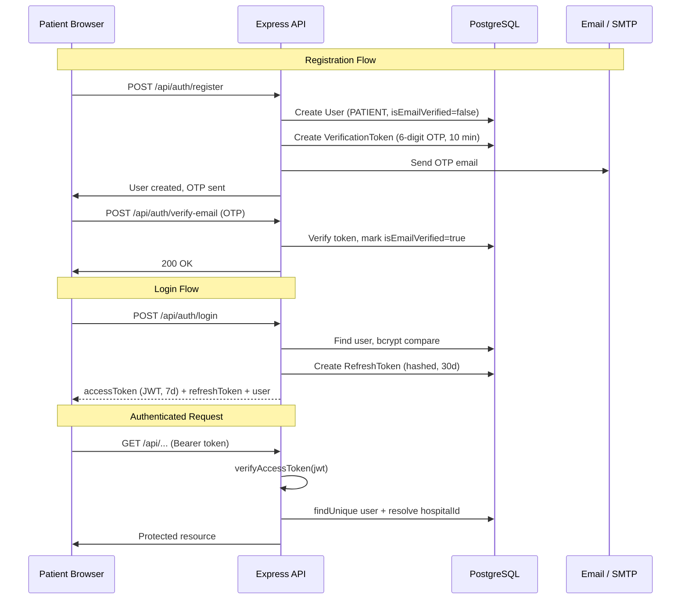

### Auth Features

| Feature | Status | Notes |
|---|---|---|
| Local registration (patients) | Implemented | Email + password, patient role only |
| 6-digit OTP email verification | Implemented | 10-min expiry, 60s resend cooldown |
| Login (email + password) | Implemented | bcryptjs comparison |
| JWT access tokens | Implemented | Default 7d expiry |
| Refresh tokens | Implemented | Stored hashed, revocable |
| Google OAuth | Implemented | `google-auth-library`, idToken verify |
| Password reset (email link) | Implemented | Tokenized link, 1-hour expiry |
| Staff invite system | Implemented | Admin creates, email with default password |
| Accept invite + set password | Implemented | `/accept-invite/:token` page |
| Account status enforcement | **Not enforced** | Deactivated accounts can still log in |

---

## 8. Authorization & Multi-Tenancy

### Hospital Isolation (verified from `scopeToHospital.js`)

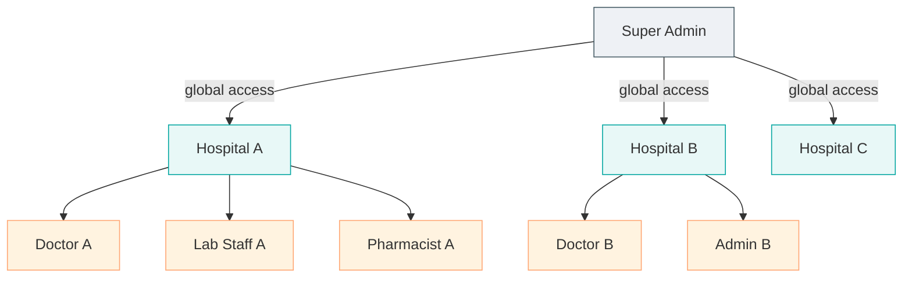

**How isolation works:**

1. `authenticate.js` resolves `req.user.hospitalId` from the DB profile of the authenticated user.
2. `scopeToHospital.js` middleware attaches `req.hospitalId` for hospital-scoped roles.
3. All service-layer queries filter by `hospitalId: req.hospitalId`.
4. `SUPER_ADMIN` has `req.hospitalId = null` — exempt from isolation.

**Scoped roles:** `HOSPITAL_ADMIN`, `RECEPTIONIST`, `PHARMACIST`, `LAB_STAFF`, `DOCTOR`, `AMBULANCE_DRIVER`

**Cross-hospital exception:** Emergency dispatch intentionally searches **all** online ambulances regardless of hospital — the only documented cross-hospital operation.

---

## 9. Patient Complete Workflow

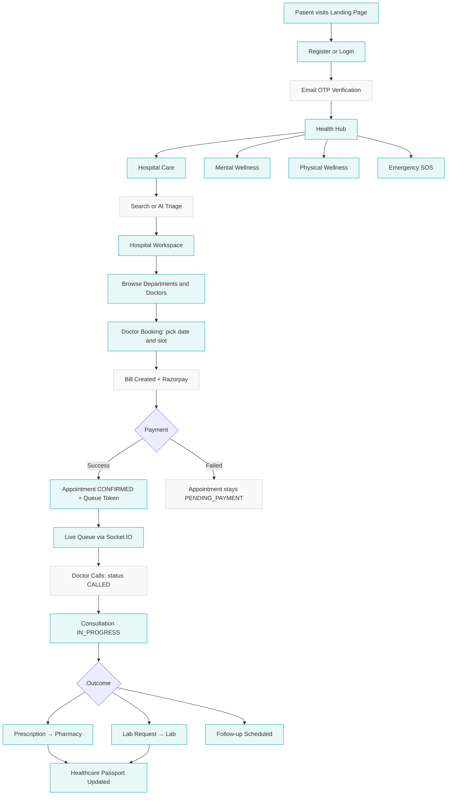

---

## 10. Hospital Care — Detailed Workflow

### AI Symptom Triage (Implemented — keyword regex, not an LLM)

> The `/api/ai/triage` endpoint uses a **keyword-based regex matcher** in `ai.service.js`, not Gemini or any LLM. It maps symptom keywords to medical specialties with urgency labels and is completely deterministic.

| Input | Output |
|---|---|
| "chest pain" | Cardiology — Critical |
| "headache, dizzy" | Neurology — High |
| "skin rash" | Dermatology — Low |
| "fever, cold" | General Medicine — Low |

### Hospital Search

- `GET /api/hospitals?city=&speciality=&search=`
- Seeded with real Vadodara hospitals (`isDemoEntity: true`)
- No geolocation proximity sorting on the server

### Doctor Booking Flow

```text
GET /api/availability/doctor/:id/slots?date=YYYY-MM-DD
  → slotGenerator.service.js computes available slots
  → Respects DoctorAvailability schedule (dayOfWeek, startTime, endTime, slotMinutes)
  → Excludes already-booked confirmed appointments
  → Excludes lunch break (12:00–13:00)

POST /api/appointments/initiate
  Body: { doctorId, scheduledDate, scheduledTime, consultationType }
  → Validates slot still available
  → Creates Appointment (PENDING_PAYMENT)
  → Calls billing.service.createBillAndInitiatePayment
  → Returns { appointmentId, billId, razorpayOrderId, amount, isMock }
```

---

## 11. Appointment System

### Status State Machine

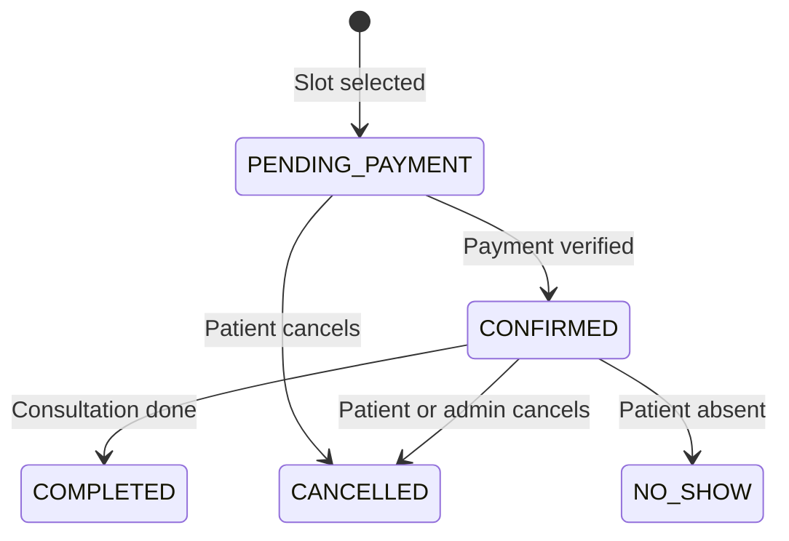

### Key Implementation Details

| Feature | Status | Detail |
|---|---|---|
| Slot generation | Implemented | `slotGenerator.service.js` |
| Lunch break exclusion | Implemented | 12:00–13:00 blocked |
| Duplicate booking prevention | Implemented | Prisma unique constraint, catches `P2002` |
| Payment-gated confirmation | Implemented | `CONFIRMED` only after billing verification |
| Queue token auto-created | Implemented | Created in the `onBillPaid` callback |
| Appointment cancellation | Implemented | Status `CANCELLED`, queue token `CANCELLED` |
| Lite appointments | Implemented | `appointmentType: LITE`, fractional `tokenNumber` |
| Online consultations | Implemented | `consultationType: ONLINE`, creates `OnlineSession` |
| Expired unpaid cleanup | Partial | `demo.service.js` only; no production cron |
| Rescheduling | Not implemented | Not present in backend services |

---

## 12. Queue Management

### Queue State Machine

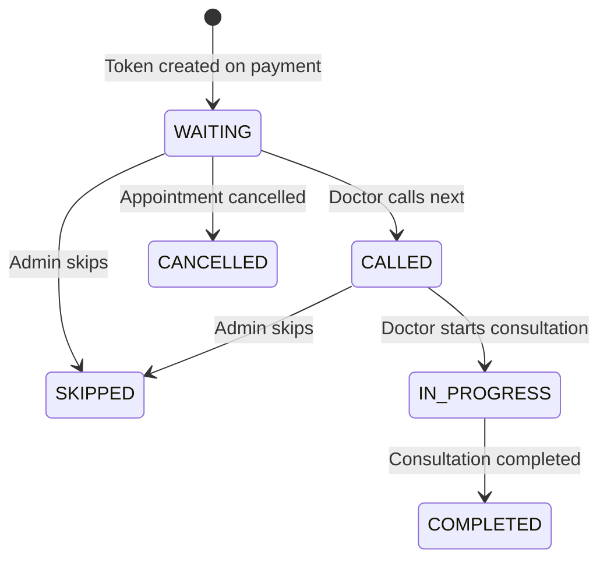

### Token Numbering

- **Regular tokens:** integer (1, 2, 3…) — sorted by `scheduledTime`
- **Lite tokens:** fractional (e.g. 15.5) — inserted between regular tokens
- `tokenNumber` is `Float` in the DB to support both

### Real-Time Queue Updates

Every queue mutation triggers `emitQueueUpdate()`:

```text
POST /api/queue/call-next (Doctor)
  → DB: token status → CALLED
  → io.to("doctor:{id}:{date}").emit("queue:updated", fullQueue)
  → io.to("hospital:{id}:queue").emit("queue:updated", fullQueue)
  → io.to("patient:{patientId}").emit("queue:updated", tokenInfo)
  → io.to("user:{patientId}").emit("notification:new", QUEUE_YOUR_TURN)
```

---

## 13. Consultation Workflow

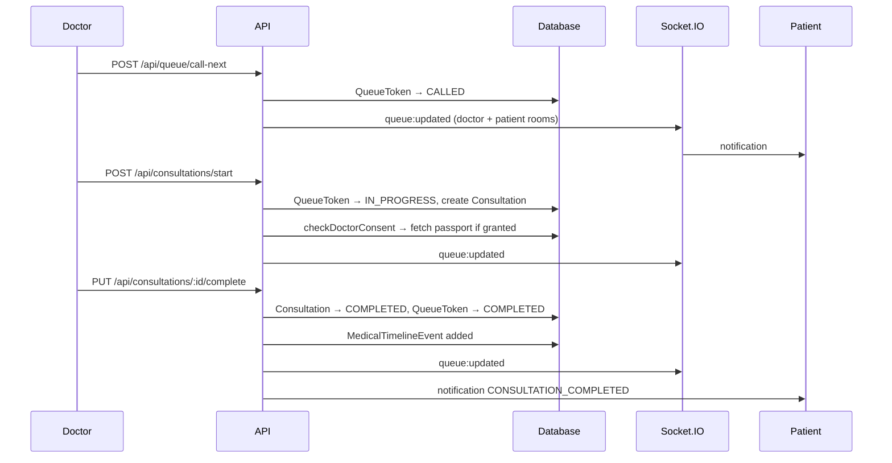

### Consultation Data Persisted

- `symptoms`, `diagnosis`, `notes`, `treatmentPlan` (all text fields)
- `status` (`IN_PROGRESS` / `COMPLETED`), `startedAt`, `completedAt`
- Linked `Prescription`, `LabRequest[]`, `FollowUpRecommendation`

### Online Consultation (Phase 16 — implemented)

- Patient books with `consultationType: ONLINE`
- `OnlineSession` created with a unique `roomId`
- WebRTC signaling via Socket.IO (`consultationHandlers.js`)
- Status: `SCHEDULED` → `WAITING_FOR_PARTICIPANTS` → `PATIENT_JOINED` → `DOCTOR_JOINED` → `IN_PROGRESS` → `COMPLETED`

---

## 14. Prescription & Pharmacy Workflow

```mermaid
flowchart LR
    classDef doctor fill:#FFF3E0,stroke:#FFA673
    classDef patient fill:#E8F8F7,stroke:#03A6A1
    classDef pharmacy fill:#EEF1F5,stroke:#455A64
    classDef system fill:#F9F9F9,stroke:#CCCCCC

    D[Doctor completes consultation]:::doctor
    D --> P["Creates Prescription + PrescriptionItems"]:::system
    P --> N1["Notification: PRESCRIPTION_CREATED → Patient"]:::system
    N1 --> PT[Patient sees prescription in dashboard]:::patient
    PT --> PO[Patient initiates PharmacyOrder]:::patient
    PO --> BILL["Bill created + Razorpay order"]:::system
    BILL --> PAY{Patient pays}
    PAY -->|Success| CONF["PharmacyOrder → CONFIRMED"]:::pharmacy
    CONF --> PH[Pharmacist sees order]:::pharmacy
    PH --> PREP[PREPARING]:::pharmacy
    PREP --> PACK[PACKED]:::pharmacy
    PACK --> READY[READY]:::pharmacy
    READY --> DONE[COMPLETED]:::pharmacy
    DONE --> N2["Notification: PHARMACY_ORDER_UPDATE → Patient"]:::system
```

**Payment gates clinical fulfillment** — the pharmacy order is only confirmed once the Bill is `PAID`.

---

## 15. Laboratory Workflow

```mermaid
flowchart LR
    classDef doctor fill:#FFF3E0,stroke:#FFA673
    classDef patient fill:#E8F8F7,stroke:#03A6A1
    classDef lab fill:#EEF1F5,stroke:#455A64

    D[Doctor writes LabRequest]:::doctor
    D --> LR[LabRequest PENDING]:::lab
    LR --> N1[Notification: LAB_REQUEST_CREATED]:::patient
    N1 --> LS["Lab Staff confirms + sets pricing"]:::lab
    LS --> CONF["LabRequest CONFIRMED + Bill created"]:::lab
    CONF --> N2["Notification: LAB_BILL_GENERATED → Patient"]:::patient
    N2 --> PAY{Patient pays}
    PAY -->|Success| SC["LabRequest → SAMPLE_COLLECTED"]:::lab
    SC --> PROC["Lab Staff → PROCESSING"]:::lab
    PROC --> RPT[Lab Staff uploads PDF report]:::lab
    RPT --> COMP["LabRequest → COMPLETED"]:::lab
    COMP --> N3["Notification: LAB_REPORT_READY → Patient + Doctor"]:::patient
```

### Lab Report Storage

- PDF uploaded via `POST /api/upload/lab-report`
- Stored in Cloudinary (requires `CLOUDINARY_*` env vars) or local filesystem
- `LabReport.reportFileUrl` stores the access URL
- Accessible to both patient and doctor

---

## 16. Billing & Payments

### Unified Billing Architecture (Phase 12)

Every payable resource (Appointment, PharmacyOrder, LabRequest) goes through one shared path:

```text
Any Service
  → billing.service.createBillAndInitiatePayment()
  → Bill created (UNPAID) + BillItems[]
  → Razorpay Order created (or MOCK order if no keys configured)
  → Payment record created (CREATED)
  → Patient pays via Razorpay widget
  → POST /api/billing/verify-payment
  → billing.service.verifyAndCompletePayment()
  → HMAC-SHA256 signature verification (or mock skip)
  → Bill → PAID, Payment → SUCCESS
  → onBillPaid(sourceType, sourceId) callback:
     APPOINTMENT      → confirmAppointment → createQueueToken
     PHARMACY_ORDER   → PharmacyOrder → CONFIRMED
     LAB_REQUEST      → LabRequest → SAMPLE_COLLECTED
  → Notification: PAYMENT_RESULT (DB + Socket.IO + Email)
```

### Mock vs Live Mode

| Condition | Behavior |
|---|---|
| `RAZORPAY_KEY_ID` not set | Mock mode — fake order IDs, signature verification always passes |
| `RAZORPAY_KEY_ID` set | Live mode — real Razorpay API, HMAC signature required |

> **No webhook implementation** — payment verification is pull-based. Webhook support is a future requirement.

---

## 17. Healthcare Passport & Medical Timeline

### Healthcare Passport

```text
HealthcarePassport
  → allergies[]            (string array)
  → medicalConditions[]    (string array)
  → currentMedications[]   (string array)
  → notes                  (text)
  → consents[]             (PassportConsent: per hospital OR per doctor)
```

- Auto-created on first access
- Patient controls consent: grant/revoke per hospital or per doctor
- A doctor can read the passport only if a `PassportConsent` exists for that `doctorId`

### Medical Timeline

Polymorphic event log:

```text
MedicalTimelineEvent {
  eventType : APPOINTMENT | CONSULTATION | PRESCRIPTION | LAB_REQUEST | LAB_REPORT | MEDICATION
  sourceId  : UUID of the source record
  title, description, eventDate
}
```

Auto-added by: `appointments.service`, `consultations.service`, `labFulfillment.service`, `prescriptions.service`

### ABDM / ABHA

**Not implemented** — not referenced anywhere in the codebase. Design aspiration only.

---

## 18. Emergency SOS System

### Complete State Machine (verified from `emergencyDispatch.service.js`)

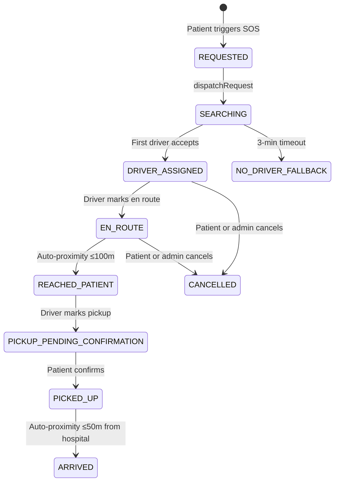

### Dispatch Algorithm (verified)

1. All online ambulances searched (`isOnline: true, isActive: true`) — cross-hospital
2. Filter to those with GPS coordinates
3. Calculate Haversine distance from patient location
4. Sort ascending by distance
5. Notify the nearest **5** drivers via the `driver:{userId}` socket room
6. First driver to accept atomically claims via `updateMany({ where: { status: 'SEARCHING' } })`
7. A second driver trying to accept gets `{ success: false }` — not treated as an error
8. **3-minute fallback timer** — no acceptance → `NO_DRIVER_FALLBACK`

### Auto-Proximity Triggers (backend-authoritative)

- Every driver GPS update → `updateDriverLocation()`
- `EN_ROUTE` + distance to patient ≤ 100m → auto `REACHED_PATIENT`
- `PICKED_UP` + distance to hospital ≤ 50m → auto `ARRIVED`

### Architectural Limitation

> **Design risk:** dispatch requires manual driver acceptance. In a true EMS/CAD system, dispatch would be automatic. If a driver ignores the notification, there is no automatic reassignment to the next driver in the list.
>
> There is **no 108 / real emergency services integration**. `NO_DRIVER_FALLBACK` does not trigger any external call.

---

## 19. Maps & Live Tracking

> The production ambulance tracking component (`LiveTrackingMap.jsx`) uses **Leaflet.js + OpenStreetMap + OSRM**. No Google Maps API key is required for ambulance tracking itself.

| Component | Library | Purpose |
|---|---|---|
| `LiveTrackingMap.jsx` | Leaflet.js + OpenStreetMap | Ambulance live tracking |
| Route calculation | OSRM (`router.project-osrm.org`) | Free road routing, no key needed |
| Hospital directions | Google Maps URLs (opens in browser) | `navigation.js` utility only |
| `googleMapsLoader.js` | Google Maps JS API | Exists, but unused by `LiveTrackingMap` |
| `__DevMapCheck.jsx` | Google Maps JS API | Dev-only test harness, not shipped to production |

### Leaflet Map Features

- Static patient location marker
- Ambulance marker with heading rotation
- OSRM polyline route overlay
- Phase A: ambulance → patient; Phase B: ambulance → hospital
- Auto-reroute every 8 seconds if the driver deviates more than 25m from the polyline
- Last known position recovery on page refresh (from `EmergencyRequest.lastDriverLat/Lng`)
- Smooth marker animation

### Driver GPS Flow

```text
Driver browser → navigator.geolocation.watchPosition()
  → PUT /api/driver/location { latitude, longitude, heading, speed }
  → updateDriverLocation() in emergencyDispatch.service.js
  → Ambulance coordinates updated in DB
  → emit("emergency:location-update") → emergency:{requestId} room
  → Patient browser receives event → Leaflet marker moves
```

---

## 20. Mental Wellness System

### Architecture (Phase 17 — fully backend-implemented)

The mental wellness system has its own module directory (`backend/src/modules/mental-health/`) with dedicated controllers, services, routes, prompts, and middleware.

### Consent System (3 Tiers)

```text
NONE     → No data collection. Module locked.
LEVEL_1  → Wellness tracking: mood, stress, sleep, activities
LEVEL_2  → AI Companion: conversations, journal, insights
LEVEL_3  → Professional Care: sessions, care plans, clinical notes
```

Consent is checked by middleware before any mental health API call.

### Complete Feature Set (all DB-backed, API-backed)

| Feature | DB Model | Status |
|---|---|---|
| Mood / wellness check-in | `MentalHealthCheckIn` | Implemented |
| One check-in per day | `unique([profileId, checkInDate])` | Implemented |
| AI Companion chat | `AIConversation`, `AIConversationMessage` | Implemented (Gemini) |
| Risk assessment per message | `AIRiskAssessment` | Implemented |
| 4-level risk system | `RiskLevel`: GREEN / YELLOW / ORANGE / RED | Implemented |
| Dual classifier (rule + AI) | Rule keywords + Gemini | Implemented |
| Crisis flow actions | `CrisisAction` | Implemented |
| Trusted contacts | `TrustedContact` | Implemented |
| Contact notification policies | NEVER / ASK_FIRST / APPROVED_EMERGENCY_ONLY | Implemented |
| Wellness content library | `WellnessContent` | Implemented |
| Activity completion | `WellnessActivity` | Implemented |
| Recommendations engine | `WellnessRecommendation` (scored) | Implemented |
| Programs & enrollment | `WellnessProgram`, `WellnessProgramEnrollment` | Implemented |
| Gratitude journaling | `GratitudeEntry` | Implemented |
| Professional connection | `ProfessionalConnection` | Implemented |
| Risk event audit log | `MentalHealthRiskEvent` | Implemented |

### Safety Engine

Every AI Companion message passes through:

1. **Rule-based keyword classifier** — deterministic regex for crisis keywords
2. **Gemini AI classifier** — structured-output risk classification
3. **Final level** = the more cautious of the two

| Risk Level | Action |
|---|---|
| GREEN | Normal wellness conversation |
| YELLOW | Compassionate response, gentle check-in |
| ORANGE | Crisis resources shown, professional referral suggested |
| RED | Emergency resources, trusted contact notification, safety plan |

### Frontend Pages (Mental Wellness)

| Page | Route | Purpose |
|---|---|---|
| `WellnessHome` | `/health-hub/mental-wellness` | Hub with mood summary, recommendations |
| `WellnessCompanion` | `/health-hub/mental-wellness/companion` | AI chat interface |
| `WellnessJourney` | `/health-hub/mental-wellness/journey` | Activities, programs, gratitude |

---

## 21. Physical Wellness System

### Architecture Decision

> **Physical Wellness data is stored in `localStorage`, not in any backend database.** The Prisma schema has no physical wellness models. All profile data, check-ins, workout history, and habits live browser-locally, keyed by user ID.

### Storage Keys (verified from `PhysicalHealth.jsx`)

| Key | Content |
|---|---|
| `pw_onboarded_v2` | Boolean — has the user completed onboarding |
| `pw_profile_v2` | Onboarding profile (goals, equipment, fitness level) |
| `pw_checkins_v2` | Array of daily readiness check-ins |
| `pw_workouts_v2` | Array of workout completion records |
| `pw_habit_defs_v2` | User-defined habit definitions |
| `pw_habit_logs_v2` | Per-day habit completion logs |

### Onboarding Steps (6-step wizard)

1. **Consent** — data usage acknowledgment
2. **Profile** — age, height, weight (with unit toggle)
3. **Goals** — primary + optional secondary goal
4. **Fitness** — fitness level, activity level, time commitment
5. **Environment** — workout location + equipment selection
6. **Summary** — review and confirm

**Equipment options:** No Equipment, Dumbbells, Resistance Bands, Gym Equipment, Other

**"No Equipment" enforcement:** when selected, the equipment array is set exclusively — other options are excluded. `generatePersonalizedDailyPlan()` filters exercises accordingly.

### Daily Readiness Check-In

Five dimensions scored 1–5: Energy, Sleep Quality, Muscle Soreness (inverted), Joint/Pain (inverted), Motivation.

`avgReadiness` = weighted average, scaled 1–10.

| Score | Status |
|---|---|
| ≥ 8/10 | READY — full intensity |
| 5–7/10 | ADJUSTED — scale back |
| < 5/10 | RECOVERY — light activity only |

### Weekly Assessment

`isWeeklyAssessmentDue()` checks whether 7 days have passed since the last assessment. This is a frontend-only timer — there's no backend cron or Monday-specific enforcement.

> **Gap:** the intended "every Monday" weekly refresh is not implemented. The system uses a 7-day rolling timer instead.

### Physical AI Assistant

- Powered by the **Gemini API called directly from the frontend** using `VITE_GEMINI_API_KEY`
- The system prompt injects profile, today's check-in, streak, current workout plan, and biometrics
- Falls back to `mockTodayWorkout` — a **static mock object** — when no active plan exists

---

## 22. Doctor Workflow

### Dashboard

```text
Login → /doctor/dashboard

Dashboard sections:
  • Today's Queue (real-time via Socket.IO)
  • Call Patient (marks token CALLED)
  • Start Consultation → /doctor/consultation/:appointmentId
  • Appointments (upcoming schedule)
  • Patient History (completed consultations)
  • Analytics (basic counts)
```

### Consultation Screen

```text
Load: appointment details + patient profile + passport (if consent)
  → Doctor fills: Symptoms, Diagnosis, Notes, Treatment Plan
  → Actions:
     • Add Prescription + PrescriptionItems
     • Add Lab Request + LabRequestItems
     • Add Follow-up Recommendation
  → Complete Consultation → PUT /api/consultations/:id/complete
  → Queue token → COMPLETED, appointment → COMPLETED
```

---

## 23. Lab Staff Workflow

### Dashboard (single component)

```text
Login → /lab/dashboard

View: incoming lab requests (PENDING / CONFIRMED / SAMPLE_COLLECTED / PROCESSING)

Actions:
  • Confirm request + set final pricing → LabRequest CONFIRMED + Bill created
  • After patient payment → LabRequest SAMPLE_COLLECTED (auto via onBillPaid)
  • Mark Processing → PROCESSING
  • Upload PDF report → COMPLETED + Patient/Doctor notified
```

---

## 24. Pharmacist Workflow

### Dashboard (single component)

```text
Login → /pharmacy/dashboard

View: pharmacy orders (CONFIRMED = patient has paid, PREPARING, PACKED, READY)

Actions (sequential progression):
  CONFIRMED → PREPARING → PACKED → READY → COMPLETED

Each transition:
  → DB status updated
  → Notification: PHARMACY_ORDER_UPDATE → Patient
```

---

## 25. Ambulance Driver Workflow

### Dashboard (single component)

```text
Login → /driver/dashboard

Actions:
  • Go Online / Offline (toggles Ambulance.isOnline)
  • Receive emergency requests (Socket.IO: emergency:new-request)
  • Accept or Reject request
  • Mark En Route
  • GPS location updates (watchPosition → PUT /api/driver/location)
  • Mark Reached Patient
  • Mark Pickup
  • Complete trip

Navigation: driver gets an "Open in Google Maps Turn-by-Turn" link
(not an embedded map — opens the native app)
```

---

## 26. Hospital Admin Workflow

### Dashboard (single tab-SPA — `admin/Dashboard.jsx`)

```text
Login → /admin/dashboard

Tabs:
  • Overview (stats: appointments, doctors, revenue)
  • Doctors (list, add via invite, manage)
  • Staff (lab, pharmacist, receptionist, driver management)
  • Departments (create, activate/deactivate)
  • Doctor Availability (configure schedule)
  • Appointments (view, manage)
  • Queue Monitor (live, Socket.IO: hospital:{id}:queue room)
  • Lab (lab requests overview)
  • Pharmacy (pharmacy orders overview)
  • Ambulances (fleet management, assign drivers)
  • Emergency (active emergency requests)
  • Billing (hospital bills, revenue)
  • Analytics (Recharts charts)
  • Audit Log (action history)
```

### Staff Management

When an admin adds staff:

1. `POST /api/staff` — creates a User with role, hospitalId, default password `Passwor123!`
2. Welcome email sent with credentials
3. Role-specific profile created

---

## 27. Super Admin Workflow

### Dashboard (single tab-SPA)

```text
Login → /superadmin/dashboard

Tabs:
  • Overview (platform stats: hospitals, patients, appointments)
  • Hospitals (list all, create new, configure)
  • Users (view all users by role)
  • Emergency (platform-wide monitoring)
  • Activity (audit log across all hospitals)
```

### Hospital Creation Flow

```text
Super Admin creates Hospital record
  → Configure: name, address, lat/lng, specialities, contact
  → Create Departments
  → Invite Hospital Admin (email invite)
  → Hospital Admin then manages their own staff
```

---

## 28. Notifications System

### Two-Layer Delivery (Phase 15 — fully implemented)

| Layer | Mechanism | Always? |
|---|---|---|
| DB persistence | `prisma.notification.create()` | Always |
| Real-time push | `io.to("user:{userId}").emit("notification:new", ...)` | Always |
| Email | `sendGenericNotificationEmail()` | 4 types only |

### Email Notification Types (4 only)

1. `APPOINTMENT_CONFIRMED`
2. `PAYMENT_RESULT` (especially failures)
3. `LAB_REPORT_READY`
4. `PASSPORT_ACCESS_CHANGED`

### Complete Notification Type List

`LAB_REPORT_READY` · `PHARMACY_ORDER_UPDATE` · `APPOINTMENT_REMINDER` · `EMERGENCY_NOTIFICATION` · `GENERAL` · `APPOINTMENT_CONFIRMED` · `APPOINTMENT_CANCELLED` · `QUEUE_YOUR_TURN` · `QUEUE_YOUR_TURN_APPROACHING` · `CONSULTATION_COMPLETED` · `PAYMENT_RESULT` · `BILL_GENERATED` · `PASSPORT_ACCESS_CHANGED` · `ONLINE_CONSULTATION_CONFIRMED` · `ONLINE_CONSULTATION_REMINDER` · `ONLINE_SESSION_STARTING` · `ONLINE_SESSION_STARTED` · `ONLINE_SESSION_COMPLETED` · `LAB_REQUEST_CREATED` · `LAB_BILL_GENERATED` · `LAB_SAMPLE_REQUESTED` · `LAB_PROCESSING` · `PRESCRIPTION_CREATED` · `PHARMACY_BILL_GENERATED` · `MENTAL_HEALTH_CRISIS` · `MENTAL_WELLNESS_CHECKIN_REMINDER` · `MENTAL_WELLNESS_STREAK`

---

## 29. Real-Time Architecture

### Rooms & Auto-Join

| Room | Auto-joined by | Used for |
|---|---|---|
| `user:{userId}` | All authenticated users | Personal notifications |
| `patient:{patientId}` | Patient role | Legacy queue events |
| `driver:{userId}` | Ambulance driver role | Emergency dispatch |

### Client-Joined Rooms (on request)

| Room | Who joins | Event |
|---|---|---|
| `doctor:{doctorId}:{date}` | Doctor + Admin | `join-doctor-queue` |
| `hospital:{hospitalId}:queue` | Hospital Admin | `join-hospital-queue` |
| `emergency:{requestId}` | Patient + assigned driver | `join-emergency-room` (with DB auth check) |

### Server-Emitted Events

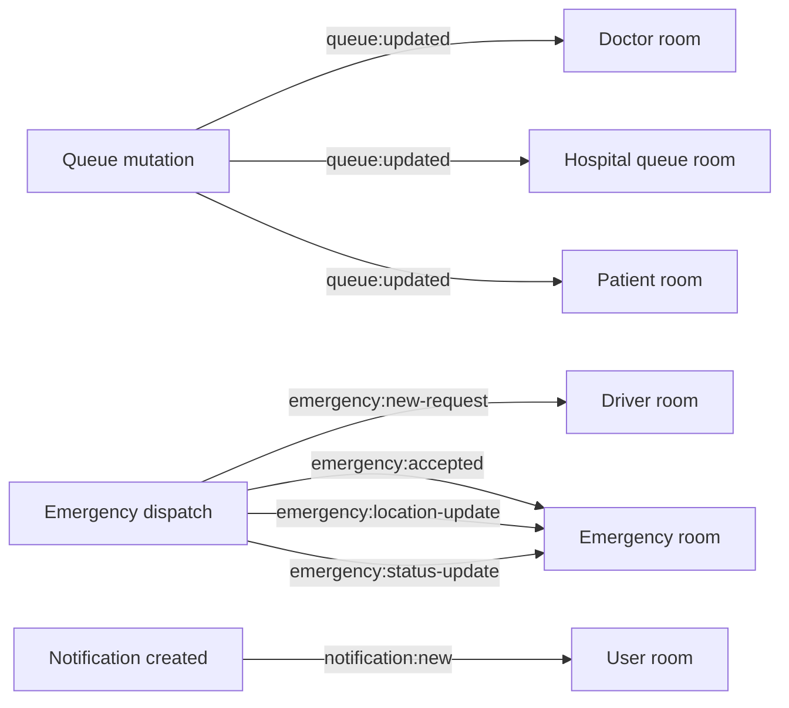

### Socket.IO Authentication

A JWT is required in `socket.handshake.auth.token` — verified on every connection using `verifyAccessToken()`.

---

## 30. Frontend Architecture

### Tech Stack

| Layer | Technology |
|---|---|
| Framework | React 19 + Vite 8 |
| Routing | React Router v7 |
| State | Zustand v5 (`authStore`, `notificationStore`) |
| Styling | Tailwind CSS v4 + custom CSS variables |
| Charts | Recharts v3 |
| Maps | Leaflet.js v1.9 (emergency tracking) |
| HTTP client | Axios v1.19 |
| Real-time | socket.io-client v4.8 |
| AI (frontend) | Direct Gemini API (`VITE_GEMINI_API_KEY`) |
| Icons | Lucide React v1.30 |
| OAuth | `@react-oauth/google` v0.13 |

### Route Structure

```text
PUBLIC
  /                                    Landing
  /login                               Login
  /register                            Patient registration
  /verify-email/:token                 OTP verification
  /forgot-password                     Password reset request
  /reset-password/:token               Password reset
  /accept-invite/:token                Staff invite acceptance
  /unauthorized                        Access denied

PATIENT (role = PATIENT)
  /health-hub                          Health Hub
  /health-hub/physical-health          Physical Wellness
  /health-hub/mental-wellness          Mental Wellness Layout
    (index)                            WellnessHome
    companion                          WellnessCompanion (AI chat)
    journey                            WellnessJourney
  /patient/dashboard                   Patient main dashboard
  /hospitals/:id                       Hospital Workspace
  /hospitals/:hId/doctors/:dId/book    Doctor Booking
  /appointments/:id/confirmation       Appointment confirmation
  /appointments/:apptId/queue          Live queue view
  /patient/passport                    Healthcare Passport
  /patient/timeline                    Medical Timeline
  /patient/emergency/:requestId        Emergency tracking (Leaflet)
  /patient/waiting-room/:apptId        Online consultation waiting room
  /patient/video-consultation/:apptId  Video consultation

DOCTOR (role = DOCTOR)
  /doctor/dashboard                    Doctor dashboard
  /doctor/queue                        Queue view
  /doctor/consultation/:apptId         Consultation screen
  /doctor/passport/:patientId          Patient profile view
  /doctor/video-consultation/:apptId   Doctor video consultation

HOSPITAL_ADMIN (role = HOSPITAL_ADMIN)
  /admin/dashboard                     Admin tab SPA

RECEPTIONIST (role = RECEPTIONIST)
  /receptionist/dashboard              Renders HospitalAdminDashboard (shared)

LAB_STAFF (role = LAB_STAFF)
  /lab/dashboard                       Lab dashboard
  /lab/requests/:requestId             Lab dashboard (same component)

PHARMACIST (role = PHARMACIST)
  /pharmacy/dashboard                  Pharmacy dashboard

AMBULANCE_DRIVER (role = AMBULANCE_DRIVER)
  /driver/dashboard                    Driver dashboard

SUPER_ADMIN (role = SUPER_ADMIN)
  /superadmin/dashboard                Super admin tab SPA
```

---

## 31. Backend Architecture

### Tech Stack

| Layer | Technology |
|---|---|
| Runtime | Node.js ≥18, ESM modules |
| Framework | Express 4.x |
| ORM | Prisma 5.x |
| Database | PostgreSQL 16+ |
| Real-time | Socket.IO 4.x |
| Auth | jsonwebtoken + bcryptjs |
| Email | Nodemailer |
| Payments | Razorpay (with mock fallback) |
| File upload | Multer + Cloudinary |
| AI | `@google/generative-ai` (Gemini) |
| Validation | Zod |
| Security | Helmet + CORS + express-rate-limit |

### Request Pipeline

```text
HTTP Request
  → helmet()               (security headers)
  → cors()                 (CORS policy)
  → express.json()         (body parsing, 1MB limit)
  → cookieParser()
  → morgan()                (dev logging)
  → Demo Mode middleware
  → /api (apiRouter)
  → authenticate            (JWT verification + req.user)
  → checkRole(...roles)     (RBAC)
  → scopeToHospital         (hospital isolation)
  → validate(schema)        (Zod)
  → controller → service → prisma → PostgreSQL
  → errorHandler            (structured error responses)
```

---

## 32. Database Architecture

### Entity Relationship Overview

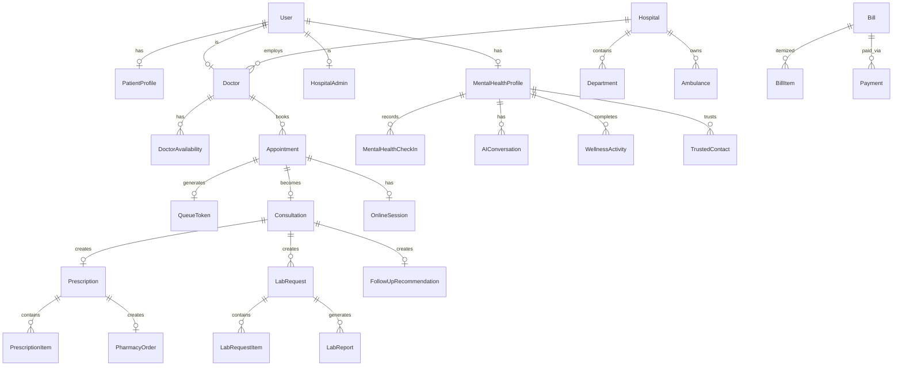

### Database Domains

| Domain | Models |
|---|---|
| Identity | User, PatientProfile, VerificationToken, PasswordResetToken, RefreshToken, InviteToken |
| Hospital | Hospital, Department, Doctor, HospitalAdmin, Receptionist, Pharmacist, LabStaff, AmbulanceDriver |
| Clinical | Appointment, DoctorAvailability, QueueToken, Consultation, OnlineSession |
| Prescription | Prescription, PrescriptionItem |
| Pharmacy | Medicine, PharmacyOrder, PharmacyOrderItem, MedicineReminder, MedicineReminderLog |
| Lab | MasterLabCategory, MasterLabTest, LabTestCatalog, LabRequest, LabRequestItem, LabReport |
| Billing | Bill, BillItem, Payment |
| Emergency | EmergencyRequest, Ambulance |
| Health Record | HealthcarePassport, PassportConsent, MedicalTimelineEvent, FollowUpRecommendation |
| Notifications | Notification |
| Audit | AuditLog |
| Mental Wellness | MentalHealthProfile, MentalHealthCheckIn, AIConversation, AIConversationMessage, AIRiskAssessment, MentalHealthRiskEvent, CrisisAction, TrustedContact, WellnessContent, WellnessProgram, WellnessActivity, WellnessRecommendation, WellnessProgramEnrollment, GratitudeEntry, ProfessionalConnection |

### Important Schema Decisions

| Decision | Reason |
|---|---|
| `QueueToken.tokenNumber: Float` | Supports fractional Lite Appointment tokens without breaking integer sorting |
| `MedicalTimelineEvent` polymorphic | `sourceId` + `eventType` avoided per-type FKs before all models existed |
| `Bill.sourceId: String` (not FK) | One billing model handles Appointment, PharmacyOrder, and LabRequest |
| `Hospital.isDemoEntity: Boolean` | All seeded real-world hospitals flagged as demo entities |

---

## 33. API Reference

All endpoints are prefixed with `/api`.

### Authentication

| Method | Endpoint | Auth | Purpose |
|---|---|---|---|
| POST | `/auth/register` | None | Register new patient |
| POST | `/auth/login` | None | Login |
| POST | `/auth/google` | None | Google OAuth login |
| POST | `/auth/verify-email` | None | Verify OTP |
| POST | `/auth/resend-verification` | None | Resend OTP |
| POST | `/auth/forgot-password` | None | Request reset link |
| POST | `/auth/reset-password` | None | Reset with token |
| POST | `/auth/refresh` | Refresh token | Refresh access token |
| POST | `/auth/logout` | JWT | Revoke refresh token |
| POST | `/auth/accept-invite` | None | Accept staff invite |

### Hospitals & Departments

| Method | Endpoint | Auth | Purpose |
|---|---|---|---|
| GET | `/hospitals` | JWT | List/search hospitals |
| GET | `/hospitals/:id` | JWT | Hospital details |
| POST | `/hospitals` | Super Admin | Create hospital |
| PUT | `/hospitals/:id` | Super Admin | Update hospital |
| GET | `/departments` | JWT | Hospital departments |
| POST | `/departments` | Hospital Admin | Create department |

### Availability & Appointments

| Method | Endpoint | Auth | Purpose |
|---|---|---|---|
| GET | `/availability/doctor/:id/slots` | JWT | Available slots |
| POST | `/availability` | Hospital Admin | Create availability |
| POST | `/appointments/initiate` | Patient | Initiate booking + bill |
| GET | `/appointments` | JWT | List appointments |
| POST | `/appointments/:id/cancel` | Patient / Admin | Cancel appointment |

### Billing & Payments

| Method | Endpoint | Auth | Purpose |
|---|---|---|---|
| POST | `/billing/verify-payment` | JWT | Verify Razorpay payment |
| GET | `/bills` | JWT | Patient's bills |
| GET | `/bills/:id` | JWT | Bill details |

### Queue

| Method | Endpoint | Auth | Purpose |
|---|---|---|---|
| GET | `/queue/doctor/:id?date=` | JWT | Doctor's queue |
| POST | `/queue/call-next` | Doctor | Call next patient |
| POST | `/queue/skip/:tokenId` | Doctor / Admin | Skip token |
| GET | `/queue/my-token/:appointmentId` | Patient | Patient's queue position |
| POST | `/admin/queue/:tokenId/skip` | Hospital Admin | Force skip |

### Consultations

| Method | Endpoint | Auth | Purpose |
|---|---|---|---|
| POST | `/consultations/start` | Doctor | Start consultation |
| PUT | `/consultations/:id/complete` | Doctor | Complete consultation |
| GET | `/consultations/:id` | JWT | Get consultation |

### Prescriptions & Pharmacy

| Method | Endpoint | Auth | Purpose |
|---|---|---|---|
| POST | `/prescriptions` | Doctor | Create prescription |
| POST | `/pharmacy-orders` | Patient | Request pharmacy order |
| PUT | `/pharmacy-orders/:id/status` | Pharmacist | Update order status |

### Laboratory

| Method | Endpoint | Auth | Purpose |
|---|---|---|---|
| POST | `/lab-requests` | Doctor | Create lab request |
| POST | `/lab-fulfillment/:id/confirm` | Lab Staff | Confirm + bill |
| POST | `/lab-fulfillment/:id/processing` | Lab Staff | Mark processing |
| POST | `/lab-fulfillment/:id/upload-report` | Lab Staff | Upload PDF |

### Emergency

| Method | Endpoint | Auth | Purpose |
|---|---|---|---|
| POST | `/emergency` | Patient | Trigger SOS |
| GET | `/emergency/:id` | JWT | Get emergency status |
| POST | `/emergency/:id/cancel` | Patient | Cancel SOS |
| POST | `/driver/accept/:requestId` | Ambulance Driver | Accept dispatch |
| PUT | `/driver/location` | Ambulance Driver | Update GPS |
| POST | `/driver/en-route/:requestId` | Ambulance Driver | Mark en route |
| POST | `/driver/mark-pickup/:requestId` | Ambulance Driver | Mark pickup |
| POST | `/driver/confirm-pickup/:requestId` | Patient | Confirm pickup |

### Healthcare Passport

| Method | Endpoint | Auth | Purpose |
|---|---|---|---|
| GET | `/passport/my` | Patient | Get own passport |
| PUT | `/passport/my` | Patient | Update passport |
| POST | `/passport/consent` | Patient | Grant consent |
| DELETE | `/passport/consent/:id` | Patient | Revoke consent |

### Mental Wellness

| Method | Endpoint | Auth | Purpose |
|---|---|---|---|
| POST | `/mental-health/consent` | Patient | Set consent level |
| POST | `/mental-health/check-in` | Patient (L1+) | Daily check-in |
| GET | `/mental-health/check-in/today` | Patient (L1+) | Today's check-in |
| POST | `/mental-health/conversations` | Patient (L2+) | Start AI conversation |
| POST | `/mental-health/conversations/:id/messages` | Patient (L2+) | Send message |
| GET | `/mental-health/recommendations` | Patient (L1+) | Get recommendations |
| POST | `/mental-health/activities` | Patient (L1+) | Log activity |
| POST | `/mental-health/gratitude` | Patient (L2+) | Add gratitude entry |

---

## 34. Socket.IO Events

### Server → Client

| Event | Room | Payload |
|---|---|---|
| `queue:updated` | Doctor room + hospital room + patient room | Full queue array |
| `queue:token-called` | Patient room | `tokenId`, `tokenNumber`, `doctorName` |
| `emergency:new-request` | Driver room | `requestId`, `patientLat`, `patientLng`, `distanceKm` |
| `emergency:accepted` | Emergency room | `driverName`, `vehicleNumber`, `driverLat`, `driverLng`, `hospital` |
| `emergency:location-update` | Emergency room | `driverLat`, `driverLng`, `heading`, `speed`, `timestamp` |
| `emergency:status-update` | Emergency room | `status`, `message`, `timestamp` |
| `emergency:joined` | Caller | `requestId`, `lastDriverLat`, `lastDriverLng`, `status` |
| `emergency:error` | Caller | `code`, `message` |
| `notification:new` | User room | Full Notification object |

### Client → Server

| Event | Purpose | Auth Check |
|---|---|---|
| `join-doctor-queue` | Join doctor's daily queue room | JWT role |
| `join-hospital-queue` | Join hospital monitor room | JWT role |
| `join-emergency-room` | Join emergency tracking room | DB ownership check |
| `leave-emergency-room` | Leave tracking room | — |
| `offer` / `answer` / `ice-candidate` | WebRTC signaling | JWT role |

---

## 35. Security Audit

### Implemented Controls

| Control | Status |
|---|---|
| Password hashing (bcryptjs) | Implemented |
| JWT access tokens | Implemented |
| Refresh tokens (stored hashed, revocable) | Implemented |
| OTP expiry (10 min) | Implemented |
| OTP resend cooldown (60s) | Implemented |
| Google OAuth (idToken verify) | Implemented |
| Role-based access (RBAC) | Implemented |
| Hospital isolation | Implemented |
| Patient ownership checks | Implemented |
| Doctor consent checks | Implemented |
| Helmet security headers | Implemented |
| CORS policy (allowlist) | Implemented |
| Rate limiting | Implemented |
| Request validation (Zod) | Implemented |
| Audit log | Implemented |
| WebSocket JWT auth | Implemented |
| Emergency room DB auth check | Implemented |
| Payment signature (HMAC-SHA256) | Implemented (live mode) |

### Risks / Gaps

| Risk | Severity |
|---|---|
| JWT expiry too long (7d) — should be 15–60 min | High |
| `UserStatus` (`DEACTIVATED`) not enforced at login | High |
| `VITE_GEMINI_API_KEY` exposed in the browser bundle | High |
| No Razorpay webhook — payment failures not handled server-side | Medium |
| No CSRF protection (mitigated by JWT in header) | Low |
| File upload type not strictly validated by Multer | Medium |
| Emergency GPS coordinates stored long-term, no retention policy | Low |

---

## 36. Feature Implementation Matrix

| Feature | Frontend | API | DB | Realtime | Status |
|---|:---:|:---:|:---:|:---:|---|
| Patient registration | ✅ | ✅ | ✅ | — | Fully implemented |
| Email OTP verification | ✅ | ✅ | ✅ | — | Fully implemented |
| Google OAuth | ✅ | ✅ | ✅ | — | Fully implemented |
| Password reset | ✅ | ✅ | ✅ | — | Fully implemented |
| Staff invite system | ✅ | ✅ | ✅ | — | Fully implemented |
| Hospital search | ✅ | ✅ | ✅ | — | Fully implemented |
| Doctor availability / slots | ✅ | ✅ | ✅ | — | Fully implemented |
| Appointment booking | ✅ | ✅ | ✅ | — | Fully implemented |
| Razorpay payment | ✅ | ✅ | ✅ | — | Fully implemented (mock fallback) |
| Live queue (Socket.IO) | ✅ | ✅ | ✅ | ✅ | Fully implemented |
| Consultation | ✅ | ✅ | ✅ | ✅ | Fully implemented |
| Prescription | ✅ | ✅ | ✅ | ✅ | Fully implemented |
| Pharmacy workflow | ✅ | ✅ | ✅ | ✅ | Fully implemented |
| Lab request | ✅ | ✅ | ✅ | ✅ | Fully implemented |
| Lab report upload | ✅ | ✅ | ✅ | ✅ | Fully implemented |
| Healthcare Passport | ✅ | ✅ | ✅ | — | Fully implemented |
| Medical Timeline | ✅ | ✅ | ✅ | — | Fully implemented |
| Emergency SOS | ✅ | ✅ | ✅ | ✅ | Fully implemented |
| Ambulance dispatch | ✅ | ✅ | ✅ | ✅ | Fully implemented |
| Live tracking (Leaflet + OSRM) | ✅ | ✅ | ✅ | ✅ | Fully implemented |
| Notifications (in-app) | ✅ | ✅ | ✅ | ✅ | Fully implemented |
| Notifications (email, 4 types) | — | ✅ | ✅ | — | Fully implemented |
| Mental wellness AI companion | ✅ | ✅ | ✅ | — | Fully implemented |
| Mental wellness check-in | ✅ | ✅ | ✅ | — | Fully implemented |
| Mental wellness content/activities | ✅ | ✅ | ✅ | — | Fully implemented |
| Mental wellness crisis escalation | ✅ | ✅ | ✅ | — | Fully implemented |
| Online consultation (WebRTC) | ✅ | ✅ | ✅ | ✅ | Fully implemented |
| Lite appointments | ✅ | ✅ | ✅ | ✅ | Fully implemented |
| Physical wellness (UI) | ✅ | — | — | — | Frontend only (localStorage) |
| Physical wellness AI assistant | ✅ | — | — | — | Frontend only (direct Gemini) |
| Audit log | — | ✅ | ✅ | — | Backend only |
| AI symptom triage | ✅ | ✅ | — | — | Implemented (keyword regex, not LLM) |
| Medicine reminders | — | ✅ | ✅ | — | Backend only (no frontend UI) |
| ABDM/ABHA integration | — | — | — | — | Not implemented |
| Production cron jobs | — | — | — | — | Not implemented |
| Razorpay webhooks | — | — | — | — | Not implemented |

---

## 37. Actual vs Intended — Gap Analysis

| Feature | Intended | Actual | Priority |
|---|---|---|---|
| AI symptom triage | Gemini LLM guidance | Keyword regex matching | P2 |
| Physical wellness backend | DB-persisted profile, plans, history | localStorage only | P1 |
| Physical wellness Monday reset | Weekly reassessment every Monday | 7-day rolling timer | P2 |
| Emergency auto-dispatch | Automatic assignment to nearest driver | Manual driver acceptance | P1 |
| Emergency 108 fallback | Call real emergency services | `NO_DRIVER_FALLBACK` status only | P0 |
| UserStatus enforcement | Deactivated accounts cannot log in | Status stored but not checked | P1 |
| Razorpay webhooks | Server-side payment failure handling | Pull-based client verification | P1 |
| Medicine reminders — frontend | Patient receives medication reminders | Backend model only, no UI | P2 |
| Map — Google Maps for tracking | Google Maps with Directions API | Leaflet + OSRM (works fine) | P3 |
| Receptionist dashboard | Dedicated features | Reuses `HospitalAdminDashboard` | P2 |
| Hospital analytics | Full revenue, performance metrics | Basic counts | P2 |
| Production cron | Auto cleanup of unpaid bookings | `demo.service.js` only | P1 |
| ABDM / ABHA | Govt health ID integration | Not implemented | P3 |

**Priority scale:** P0 = safety critical · P1 = core product gap · P2 = quality improvement · P3 = nice-to-have

---

## 38. Edge Cases & Known Issues

### Authentication

- Expired OTP: rejected with an error; patient must resend
- Wrong OTP: rejected; token stays valid until expiry
- Expired JWT: `verifyAccessToken` throws; client must refresh
- **Deactivated accounts can still log in — status not enforced**
- Revoked refresh token: rejected at the refresh endpoint

### Appointments

- Duplicate booking: caught by Prisma's `P2002` unique constraint
- Payment failure: appointment stays `PENDING_PAYMENT`
- Slot collision: re-validated at booking time
- **No production cleanup job for expired unpaid appointments**

### Queue

- Doctor unavailable: admin can skip tokens
- Concurrent call-next: `updateMany` prevents double-calling

### Emergency

- No drivers online: immediate `NO_DRIVER_FALLBACK`
- Race condition (multiple drivers accept): `updateMany` is atomic — only one wins
- Driver loses connection: last known position recovered from `lastDriverLat/Lng`
- Patient loses connection: position recovered from the `emergency:joined` payload
- GPS unavailable: no fallback if the patient denies GPS permission
- **Driver ignores requests: 3-min timeout → `NO_DRIVER_FALLBACK`, no reassignment**
- **No 108 / real emergency services integration**

### Mental Wellness

- One check-in per day: DB unique constraint on `[profileId, checkInDate]`
- Legacy rows (`null checkInDate`) are excluded from the unique constraint

### Physical Wellness

- `localStorage` cleared → all physical wellness data lost, no recovery
- Multiple devices → data not synced
- `mockTodayWorkout` fallback used when no active plan exists — static mock data

---

## 39. Environment Variables

### Backend (`backend/.env`)

| Variable | Required | Purpose |
|---|---|---|
| `PORT` | Yes | Server port (default: 5000) |
| `NODE_ENV` | Yes | Environment (development/production) |
| `CLIENT_URL` | Yes | Frontend URL for CORS |
| `DATABASE_URL` | Yes | PostgreSQL connection string |
| `JWT_SECRET` | Yes | JWT signing secret |
| `JWT_EXPIRES_IN` | No | Token expiry (default: 7d) |
| `GOOGLE_CLIENT_ID` | For OAuth | Google OAuth client ID |
| `GOOGLE_CLIENT_SECRET` | For OAuth | Google OAuth secret |
| `EMAIL_HOST` | For email | SMTP host |
| `EMAIL_PORT` | For email | SMTP port |
| `EMAIL_USER` | For email | SMTP username |
| `EMAIL_PASSWORD` | For email | SMTP password |
| `RAZORPAY_KEY_ID` | For live payments | Razorpay key (omit for mock mode) |
| `RAZORPAY_KEY_SECRET` | For live payments | Razorpay secret |
| `CLOUDINARY_CLOUD_NAME` | For file uploads | Cloudinary account |
| `CLOUDINARY_API_KEY` | For file uploads | Cloudinary key |
| `CLOUDINARY_API_SECRET` | For file uploads | Cloudinary secret |
| `AI_API_KEY` | For mental wellness AI | Gemini API key |
| `DEMO_MODE` | No | Rolls demo appointments daily |

### Frontend (`frontend/.env`)

| Variable | Required | Purpose |
|---|---|---|
| `VITE_API_URL` | Yes | Backend API base URL |
| `VITE_GOOGLE_CLIENT_ID` | For OAuth | Google OAuth client ID |
| `VITE_RAZORPAY_KEY_ID` | For live payments | Razorpay public key |
| `VITE_CLOUDINARY_CLOUD_NAME` | For uploads | Cloudinary account |
| `VITE_GOOGLE_MAPS_API_KEY` | For dev map harness | Google Maps JS API key |
| `VITE_GEMINI_API_KEY` | For physical AI | Gemini API key (browser-exposed, security risk) |

---

## 40. Installation & Setup

### Prerequisites

- Node.js ≥ 18.0.0
- PostgreSQL 16+

### 1. Install Dependencies

```bash
# Backend
cd healthcare-plus/backend && npm install

# Frontend
cd healthcare-plus/frontend && npm install
```

### 2. Configure Environment

```bash
cp backend/.env.example backend/.env
cp frontend/.env.example frontend/.env
# Edit both files with your values
```

### 3. Database Setup

```bash
cd backend

# Generate Prisma client
npx prisma generate

# Run migrations
npx prisma migrate deploy

# Seed demo data (hospitals, doctors, staff accounts)
npm run seed:demo

# Optional: seed lab test catalog
node prisma/seedLabTests.js

# Optional: seed mental wellness content
node prisma/seedWellnessContent.js
```

### 4. Start Development Servers

```bash
# Terminal 1: Backend (http://localhost:5000)
cd backend && npm run dev

# Terminal 2: Frontend (http://localhost:5173)
cd frontend && npm run dev
```

### 5. Verify

```bash
curl http://localhost:5000/api/health
# → { "status": "ok", "timestamp": "..." }
```

### Demo Credentials

See `healthcare-plus/CREDENTIALS.md` for seeded demo accounts.
Default staff password: `Passwor123!`

---

## 41. Testing

### Backend Tests

```bash
cd backend && npm test
```

| Test File | Coverage | Status |
|---|---|---|
| `auth.test.js` | Registration, login, OTP, refresh | Has tests |
| `consultations.test.js` | Start/complete consultation | Has tests |
| `emergencyDispatch.test.js` | Dispatch, accept, location, proximity | Has tests |
| `notifications.test.js` | Notify function, DB persist | Has tests |
| `scopeToHospital.test.js` | Hospital isolation middleware | Has tests |
| `geo.test.js` | Haversine distance calculation | Has tests |
| `ai.test.js` | Symptom triage keyword matching | Has tests |
| `analytics.test.js` | Analytics endpoint | Has tests |
| `billing.test.js` | Bill creation | Has tests |

**Framework:** Jest + Supertest

### Frontend Tests

A Playwright config exists (`playwright.config.ts`) but no test files were found. E2E tests are **not implemented**.

### Coverage Summary

| Area | Tests | Notes |
|---|---|---|
| Backend auth | Yes | Core flows |
| Backend emergency | Yes | Dispatch + proximity |
| Backend consultations | Yes | Core workflow |
| Backend RBAC | Yes | `scopeToHospital` |
| Mental wellness API | No | Phase 17 untested |
| Physical wellness | No | localStorage-only, untested |
| Frontend unit | No | None |
| Frontend E2E | No | Config only |

---

## 42. Folder Structure

```text
healthcare-plus/
├── backend/
│   ├── prisma/
│   │   ├── schema.prisma               # DB schema (1511 lines, 17 phases)
│   │   ├── seed.js                     # Demo data seeding
│   │   ├── seedLabTests.js             # Lab test catalog seeding
│   │   ├── seedWellnessContent.js      # Mental wellness content seeding
│   │   └── vadodaraHospitalsData.js    # Real hospital reference data
│   └── src/
│       ├── app.js                      # Express application setup
│       ├── server.js                   # HTTP server + Socket.IO bootstrap
│       ├── config/                     # Env, CORS configuration
│       ├── controllers/                # Request handlers (27 files)
│       ├── middleware/                 # authenticate, checkRole, scopeToHospital, validate
│       ├── modules/
│       │   └── mental-health/          # Self-contained mental wellness module
│       │       ├── controllers/
│       │       ├── middleware/         # consentCheck middleware
│       │       ├── prompts/            # Gemini prompt templates
│       │       ├── routes/
│       │       └── services/
│       ├── routes/                     # Express routers (34 files)
│       ├── services/                   # Business logic (35 files)
│       ├── sockets/
│       │   ├── index.js                # Connection + room management
│       │   ├── emergencyHandlers.js    # Emergency socket handlers
│       │   └── consultationHandlers.js # WebRTC signaling handlers
│       ├── templates/                  # Email HTML templates
│       ├── utils/                      # ApiError, jwt, hash, geo
│       └── __tests__/                  # Jest test files (11 files)
└── frontend/
    └── src/
        ├── components/                 # Reusable components by domain
        │   ├── emergency/
        │   │   └── LiveTrackingMap.jsx # Leaflet.js ambulance tracker
        │   ├── mentalWellness/
        │   ├── physicalWellness/
        │   ├── queue/
        │   └── auth/
        │       └── ProtectedRoute.jsx
        ├── data/
        │   ├── physicalWellnessMockData.js  # Workout generator + localStorage helpers
        │   └── wellnessMockData.js
        ├── pages/                      # Route-level pages by role
        │   ├── patient/
        │   │   └── physicalWellness/   # 16 physical wellness sub-pages
        │   ├── doctor/
        │   ├── admin/
        │   ├── lab/
        │   ├── pharmacy/
        │   ├── driver/
        │   └── superadmin/
        ├── router/
        │   └── AppRouter.jsx           # All routes + ProtectedRoute guards
        ├── services/                   # Axios API service layer (27 files)
        ├── store/
        │   ├── authStore.js            # Zustand: user session
        │   └── notificationStore.js    # Zustand: notification state
        └── utils/                      # googleMapsLoader, navigation, emergencyRouting
```

---

## 43. Design System

### Color Palette

| Token | Hex | Use |
|---|---|---|
| Primary Teal | `#03A6A1` | Primary actions, borders, focus rings |
| Soft Cream | `#FFE3BB` | Secondary backgrounds, warm accents |
| Warm Orange | `#FFA673` | Doctor/hospital highlights, secondary CTAs |
| Emergency Red | `#FF4F0F` | Emergency, critical alerts, SOS |
| Success | `#10B981` | Confirmed, completed |
| Warning | `#F59E0B` | Pending, attention needed |
| Error | `#EF4444` | Errors, failures |
| Neutral | `#64748B` | Muted text, borders |

### Diagram Color Classes (for Mermaid)

```text
classDef patient   fill:#E8F8F7,stroke:#03A6A1
classDef doctor    fill:#FFF3E0,stroke:#FFA673
classDef emergency fill:#FFE8E3,stroke:#FF4F0F
classDef admin     fill:#EEF1F5,stroke:#455A64
classDef wellness  fill:#FFF8E8,stroke:#FFA673
```

---

## 44. Technical Debt & Future Roadmap

### Critical (P0)

- [ ] Emergency: 108 fallback integration when `NO_DRIVER_FALLBACK`
- [ ] Emergency: automatic reassignment if a driver fails/disconnects

### High Priority (P1)

- [ ] Physical wellness: migrate from `localStorage` to backend DB (new Prisma models needed)
- [ ] Physical wellness: Monday weekly reset with server-side enforcement
- [ ] `UserStatus`: enforce `DEACTIVATED` in the login middleware
- [ ] Production cron: cleanup expired `PENDING_PAYMENT` appointments
- [ ] Razorpay webhooks: server-side payment event handling
- [ ] JWT: shorten access token expiry (15 min) with a proper refresh flow

### Medium Priority (P2)

- [ ] AI symptom triage: replace keyword regex with a Gemini LLM call
- [ ] Receptionist: dedicated dashboard features
- [ ] Medicine reminders: patient-facing frontend UI
- [ ] Analytics: complete revenue/performance dashboard
- [ ] Test coverage: mental wellness API tests, frontend E2E tests
- [ ] Physical wellness AI assistant: backend proxy (remove exposed `VITE_GEMINI_API_KEY`)
- [ ] Hospital search: proximity sorting using patient geolocation

### Nice-to-Have (P3)

- [ ] ABDM/ABHA government health ID integration
- [ ] Multi-language support
- [ ] Mobile app
- [ ] Advanced analytics
- [ ] Live chat (patient to doctor)

---

## 45. Project Health Scores

Scored against production-ready standards — no inflation.

| Dimension | Score | Notes |
|---|---|---|
| Architecture | 8/10 | Clean service layer, multi-tenancy, proper error handling |
| Backend | 8/10 | Well-organized, good transactions, Socket.IO |
| Frontend | 7/10 | Good structure, but physical wellness uses localStorage |
| Database | 8/10 | Thoughtful schema, good indexes, clear phase comments |
| Security | 6/10 | Good foundation; JWT too long, UserStatus gap, Gemini key exposed |
| RBAC | 8/10 | `checkRole` + `scopeToHospital` well-implemented |
| Real-Time | 8/10 | Socket.IO well-structured, room management, JWT auth |
| Emergency | 6/10 | Working, but manual dispatch is a clinical risk; no 108 fallback |
| Mental Wellness | 9/10 | Most complete module — AI, safety, consent, trusted contacts |
| Physical Wellness | 4/10 | Great UI but fully localStorage-based |
| Testing | 5/10 | Backend core covered; no frontend tests, no mental wellness tests |
| Documentation | 7/10 | This README is the authoritative source |
| Production Readiness | 6/10 | Core flows work; needs cron, webhooks, shorter JWT |

**Overall: 7/10** — strong foundation, excellent portfolio/hackathon project. Specific hardening is needed before clinical deployment.

---

## 46. Glossary

| Term | Definition |
|---|---|
| Health Hub | Patient's home screen with 3 journey options |
| Queue Token | Numbered ticket after a confirmed appointment; tracked live via Socket.IO |
| Lite Appointment | Fast-track appointment with a fractional queue token |
| `scopeToHospital` | Backend middleware restricting hospital-role users to their own hospital |
| `onBillPaid` | Callback executed after payment verification; triggers the downstream workflow |
| `PassportConsent` | Patient-granted permission for a doctor/hospital to read the Healthcare Passport |
| Risk Level | 4-tier mental health risk: GREEN, YELLOW, ORANGE, RED |
| Dispatch | Process of finding and notifying ambulance drivers for an emergency SOS |
| OSRM | Open Source Routing Machine — free road routing API used for ambulance routes |
| Demo Entity | Seeded hospital flagged `isDemoEntity: true` — real-world reference data |
| `DEMO_MODE` | Backend env flag that rolls appointment dates forward for live demos |
| `isMock` | Razorpay response flag indicating the system is running without real credentials |
| Medical Timeline | Chronological event log of a patient's clinical history |

---

*Healthcare+ v1.0 — source of truth for this document is the actual code: `schema.prisma`, route files, service files, and frontend pages.*