# healthcare+ — Entity-Relationship Diagram

## Design Decision: Lab Reports

A single `LabRequest` (one order) can contain multiple `LabRequestItem`s (individual tests). Each `LabRequestItem` gets its own `LabReport` (one report per test item), allowing partial reporting — some tests may be ready before others. The `LabRequest` status aggregates from its items.

## Mermaid ER Diagram

```mermaid
erDiagram

    %% ─────────────────────────────────────────────
    %% ENUMS (represented as entity notes)
    %% Role: PATIENT | DOCTOR | HOSPITAL_ADMIN | RECEPTIONIST | PHARMACIST | LAB_STAFF | AMBULANCE_DRIVER | SUPER_ADMIN
    %% AppointmentStatus: PENDING_PAYMENT | CONFIRMED | CANCELLED | IN_CONSULTATION | COMPLETED | NO_SHOW
    %% QueueStatus: WAITING | IN_PROGRESS | DONE | SKIPPED
    %% PharmacyOrderStatus: PENDING | CONFIRMED | PREPARING | PACKED | READY | COMPLETED | CANCELLED
    %% LabRequestStatus: PENDING | SAMPLE_COLLECTED | PROCESSING | REPORT_READY | REJECTED | UNAVAILABLE
    %% PaymentStatus: PENDING | SUCCESS | FAILED | REFUNDED
    %% EmergencyStatus: PENDING | DISPATCHED | EN_ROUTE | ARRIVED | COMPLETED | ESCALATED_TO_108
    %% CrowdLevel: LOW | MODERATE | HIGH | CRITICAL
    %% ─────────────────────────────────────────────

    User {
        string id PK
        string email UK
        string passwordHash "nullable"
        string fullName
        string role "enum Role"
        boolean isEmailVerified
        string googleId "nullable, unique"
        datetime createdAt
        datetime updatedAt
    }

    Patient {
        string id PK
        string userId FK
        string bloodGroup "nullable"
        string phone "nullable"
        date dateOfBirth "nullable"
        string gender "nullable"
        string address "nullable"
        string emergencyContactName "nullable"
        string emergencyContactPhone "nullable"
        datetime createdAt
        datetime updatedAt
    }

    Doctor {
        string id PK
        string userId FK
        string hospitalId FK
        string departmentId FK
        string specialization
        int experienceYears
        decimal consultationFee
        boolean isActive
        datetime createdAt
        datetime updatedAt
    }

    HospitalAdmin {
        string id PK
        string userId FK
        string hospitalId FK
        datetime createdAt
        datetime updatedAt
    }

    Receptionist {
        string id PK
        string userId FK
        string hospitalId FK
        datetime createdAt
        datetime updatedAt
    }

    Pharmacist {
        string id PK
        string userId FK
        string hospitalId FK
        datetime createdAt
        datetime updatedAt
    }

    LabStaff {
        string id PK
        string userId FK
        string hospitalId FK
        datetime createdAt
        datetime updatedAt
    }

    AmbulanceDriver {
        string id PK
        string userId FK
        string hospitalId FK
        string ambulanceId FK "nullable"
        datetime createdAt
        datetime updatedAt
    }

    Hospital {
        string id PK
        string name
        string address
        string city
        float latitude
        float longitude
        string contactPhone
        string contactEmail
        string crowdLevel "enum CrowdLevel"
        float rating "nullable"
        boolean isActive
        datetime createdAt
        datetime updatedAt
    }

    Department {
        string id PK
        string name
        string hospitalId FK
        boolean isActive
        datetime createdAt
        datetime updatedAt
    }

    DoctorAvailability {
        string id PK
        string doctorId FK
        int dayOfWeek "0=Sun..6=Sat"
        time startTime
        time endTime
        int slotDurationMinutes
        int maxPatients
        datetime createdAt
        datetime updatedAt
    }

    Appointment {
        string id PK
        string patientId FK
        string doctorId FK
        string hospitalId FK
        date appointmentDate
        time appointmentTime
        string status "enum AppointmentStatus"
        string notes "nullable"
        boolean isLiteAppointment
        datetime createdAt
        datetime updatedAt
    }

    QueueToken {
        string id PK
        string appointmentId FK
        int position
        string status "enum QueueStatus"
        datetime calledAt "nullable"
        datetime completedAt "nullable"
        datetime createdAt
        datetime updatedAt
    }

    HealthcarePassport {
        string id PK
        string patientId FK
        string bloodGroup "nullable"
        json allergyList
        json chronicConditions
        json vaccinationHistory
        json consultationHistory
        json prescriptionHistory
        json labHistory
        datetime createdAt
        datetime updatedAt
    }

    PassportConsent {
        string id PK
        string passportId FK
        string grantedToDoctorId FK "nullable"
        string grantedToHospitalId FK "nullable"
        datetime expiresAt "nullable"
        datetime createdAt
        datetime updatedAt
    }

    Consultation {
        string id PK
        string appointmentId FK
        string doctorId FK
        string patientId FK
        string chiefComplaint
        string examinationNotes "nullable"
        string diagnosis "nullable"
        string referralNotes "nullable"
        boolean isCompleted
        datetime completedAt "nullable"
        datetime createdAt
        datetime updatedAt
    }

    Prescription {
        string id PK
        string consultationId FK
        datetime createdAt
        datetime updatedAt
    }

    PrescriptionItem {
        string id PK
        string prescriptionId FK
        string medicineId FK
        string dosage
        string frequency
        string duration
        string instructions "nullable"
        datetime createdAt
        datetime updatedAt
    }

    Medicine {
        string id PK
        string name
        string genericName "nullable"
        string category
        string unit
        boolean isActive
        datetime createdAt
        datetime updatedAt
    }

    PharmacyOrder {
        string id PK
        string patientId FK
        string hospitalId FK
        string prescriptionId FK "nullable"
        string status "enum PharmacyOrderStatus"
        decimal totalAmount
        datetime createdAt
        datetime updatedAt
    }

    PharmacyOrderItem {
        string id PK
        string pharmacyOrderId FK
        string medicineId FK
        int quantity
        decimal unitPrice
        boolean isAvailable
        datetime createdAt
        datetime updatedAt
    }

    MedicineReminder {
        string id PK
        string patientId FK
        string prescriptionItemId FK
        time reminderTime
        boolean isActive
        datetime createdAt
        datetime updatedAt
    }

    LabTestCatalog {
        string id PK
        string name
        string category
        string description "nullable"
        decimal price
        boolean isActive
        datetime createdAt
        datetime updatedAt
    }

    LabRequest {
        string id PK
        string consultationId FK
        string patientId FK
        string hospitalId FK
        string status "enum LabRequestStatus"
        datetime createdAt
        datetime updatedAt
    }

    LabRequestItem {
        string id PK
        string labRequestId FK
        string labTestCatalogId FK
        datetime createdAt
        datetime updatedAt
    }

    LabReport {
        string id PK
        string labRequestItemId FK
        string fileUrl
        string findings "nullable"
        string uploadedByLabStaffId FK
        datetime createdAt
        datetime updatedAt
    }

    Bill {
        string id PK
        string patientId FK
        string hospitalId FK
        string appointmentId FK "nullable"
        decimal totalAmount
        boolean isPaid
        datetime createdAt
        datetime updatedAt
    }

    BillItem {
        string id PK
        string billId FK
        string description
        decimal amount
        string itemType "APPOINTMENT | PHARMACY | LAB | OTHER"
        datetime createdAt
        datetime updatedAt
    }

    Payment {
        string id PK
        string billId FK
        string patientId FK
        decimal amount
        string status "enum PaymentStatus"
        string razorpayOrderId "nullable"
        string razorpayPaymentId "nullable"
        string razorpaySignature "nullable"
        datetime createdAt
        datetime updatedAt
    }

    EmergencyRequest {
        string id PK
        string patientId FK
        string ambulanceId FK "nullable"
        string hospitalId FK "nullable"
        float latitude
        float longitude
        string description "nullable"
        string status "enum EmergencyStatus"
        datetime dispatchedAt "nullable"
        datetime completedAt "nullable"
        datetime createdAt
        datetime updatedAt
    }

    Ambulance {
        string id PK
        string hospitalId FK
        string vehicleNumber
        boolean isAvailable
        datetime createdAt
        datetime updatedAt
    }

    Notification {
        string id PK
        string userId FK
        string title
        string message
        string type
        boolean isRead
        datetime createdAt
        datetime updatedAt
    }

    AuditLog {
        string id PK
        string actorUserId FK
        string hospitalId FK "nullable"
        string action
        string targetEntity
        string targetEntityId
        json metadata "nullable"
        datetime createdAt
    }

    %% ─────────────────────────────────────────────
    %% RELATIONSHIPS
    %% ─────────────────────────────────────────────

    User ||--o| Patient : "has profile"
    User ||--o| Doctor : "has profile"
    User ||--o| HospitalAdmin : "has profile"
    User ||--o| Receptionist : "has profile"
    User ||--o| Pharmacist : "has profile"
    User ||--o| LabStaff : "has profile"
    User ||--o| AmbulanceDriver : "has profile"

    Hospital ||--|{ Department : "has"
    Hospital ||--|{ Doctor : "employs"
    Hospital ||--|{ HospitalAdmin : "has"
    Hospital ||--|{ Receptionist : "has"
    Hospital ||--|{ Pharmacist : "has"
    Hospital ||--|{ LabStaff : "has"
    Hospital ||--|{ Ambulance : "owns"
    Hospital ||--|{ Appointment : "hosts"
    Hospital ||--|{ PharmacyOrder : "handles"
    Hospital ||--|{ LabRequest : "processes"
    Hospital ||--|{ Bill : "issues"
    Hospital ||--|{ EmergencyRequest : "destination for"

    Department ||--|{ Doctor : "contains"

    Doctor ||--|{ DoctorAvailability : "has"
    Doctor ||--|{ Appointment : "handles"
    Doctor ||--|{ Consultation : "conducts"

    Patient ||--|{ Appointment : "books"
    Patient ||--|| HealthcarePassport : "owns"
    Patient ||--|{ PharmacyOrder : "places"
    Patient ||--|{ LabRequest : "undergoes"
    Patient ||--|{ Bill : "owes"
    Patient ||--|{ EmergencyRequest : "triggers"
    Patient ||--|{ MedicineReminder : "has"
    Patient ||--|{ Payment : "makes"

    Appointment ||--|| QueueToken : "generates"
    Appointment ||--o| Consultation : "leads to"

    Consultation ||--|{ Prescription : "produces"
    Consultation ||--|{ LabRequest : "orders"

    Prescription ||--|{ PrescriptionItem : "contains"
    PrescriptionItem }o--|| Medicine : "references"
    Prescription ||--o| PharmacyOrder : "fulfilled by"

    PharmacyOrder ||--|{ PharmacyOrderItem : "contains"
    PharmacyOrderItem }o--|| Medicine : "references"

    PrescriptionItem ||--|{ MedicineReminder : "triggers"

    LabRequest ||--|{ LabRequestItem : "contains"
    LabRequestItem }o--|| LabTestCatalog : "references"
    LabRequestItem ||--o| LabReport : "results in"
    LabReport }o--|| LabStaff : "uploaded by"

    Bill ||--|{ BillItem : "itemized as"
    Bill ||--|{ Payment : "paid via"

    HealthcarePassport ||--|{ PassportConsent : "grants"
    PassportConsent }o--o| Doctor : "granted to"
    PassportConsent }o--o| Hospital : "granted to"

    EmergencyRequest }o--o| Ambulance : "assigned to"
    AmbulanceDriver }o--o| Ambulance : "drives"

    Notification }o--|| User : "sent to"
    AuditLog }o--|| User : "actor"
    AuditLog }o--o| Hospital : "scoped to"
```

